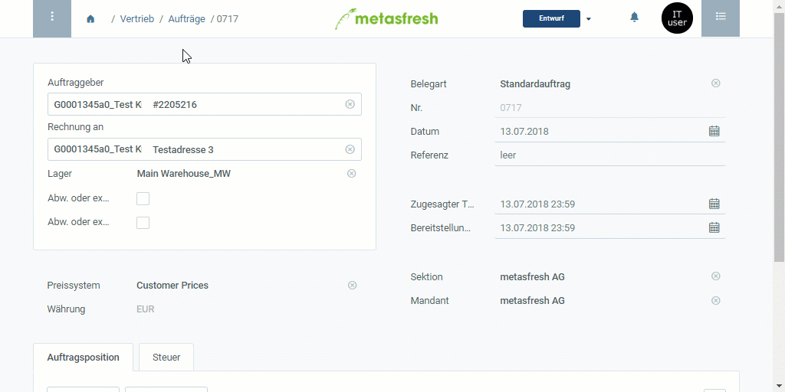

## Übersicht
Eine auftragszeilenspezifische Produktbeschreibung kann nur im Auftrag erfasst werden und erscheint anschließend auch nur auf der Auftragsbestätigung unterhalb des Produktnamens.

Weitere Informationen darüber, wie Du eigenen Text in Belege einfügen kannst, gibt es [hier](Text_auf_Belege_drucken-allgemein).

## Schritte
- Folge der [Anleitung zur Erfassung eines Auftrags](Auftrag_erfassen) bis zum **Schritt 4 der Auftragszeileneingabe**.

### Variante 1: Direkter Weg über die Auftragszeile
1. Bewege die horizontale Bildlaufleiste der Auftragszeilentabelle nach rechts, bis Du die Spalte **Beschreibung** erreichst.
1. Klicke doppelt auf das Feld **Beschreibung** der Auftragszeile, für die Du eine Beschreibung erfassen möchtest, und gib dort einen Text ein.
1. Bestätige mit `↵ Enter` oder klicke irgendwo im Auftrag auf eine freie Fläche.

### Variante 2: Umweg über die "Erweiterte Erfassung"
1. Öffne die "[Erweiterte Erfassung](AdvancedEditTab_Öffnen)" der Auftragszeile, für die Du eine Beschreibung erfassen möchtest.
1. Scrolle runter bis zum Textfeld **Beschreibung** und gib hier Deinen Text ein.
1. Klicke auf "Bestätigen", um die Änderungen zu übernehmen und die "Erweiterte Erfassung" zu schließen.

## Nächste Schritte
- Folge den restlichen Schritten zur [Auftragserfassung](Auftrag_erfassen), um den Auftrag abzuschließen.

## Beispiel

