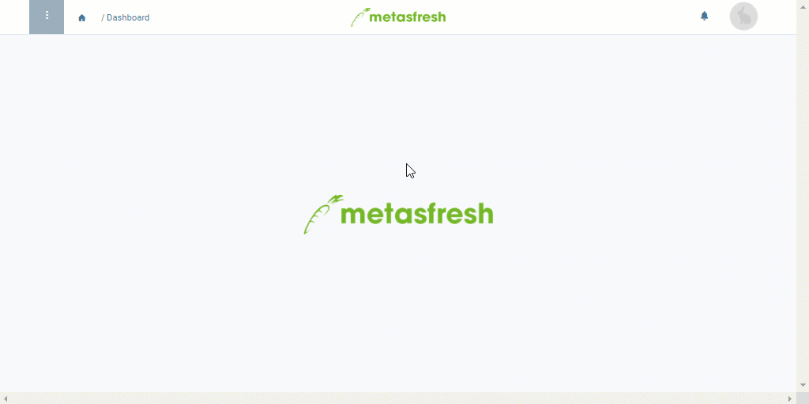

## Überblick
Damit Du [Belege per E-Mail aus "Ausgehende Belege" versenden](Email_senden_ausgehende_Belege) kannst, müssen sie mit einer E-Mail-Adresse versehen sein. Möchtest Du den Empfänger ändern, der beispielsweise durch das [E-Mail-Server-Routing](Email_Server_Routing_einrichten) eingetragen wurde, oder eine ganz andere E-Mail-Adresse angeben, dann gehe wie folgt vor:

## Schritte

### Eintrag öffnen
1. [Gehe ins Menü](Menu) und öffne das Fenster "Ausgehende Belege".
1. Öffne den Eintrag des Beleges, dessen Empfängerdaten Du ändern möchtest, aus der [Listenansicht](Ansichten#listenansicht).

### a) Anderen Geschäftspartnerkontakt auswählen
1. Gib im Feld **Mailempfänger** einen Teil des Namens des [Kontaktes/Nutzers](GPartner_Nutzer_hinzufuegen) des Geschäftspartners ein und klicke auf den passenden Treffer in der <a href="Keyboard_Shortcuts_Liste#dropdown" title="Dynamisches Suchfeld (Autocomplete)">Dropdown-Liste</a>.
1. Das Feld **Mailadresse** wird in diesem Fall automatisch ausgefüllt, sofern eine E-Mail-Adresse vorhanden ist.

### b) Abweichenden E-Mail-Empfänger angeben
1. Entferne den Inhalt aus den Feldern **Mailempfänger** und **Mailadresse**, falls erforderlich.
1. Trage eine abweichende **Mailadresse** ein.
1. [metasfresh speichert automatisch](Speicheranzeige).

## Nächste Schritte
- [Versende die E-Mail an den neuen Empfänger aus "Ausgehende Belege"](Email_senden_ausgehende_Belege).

## Beispiel

