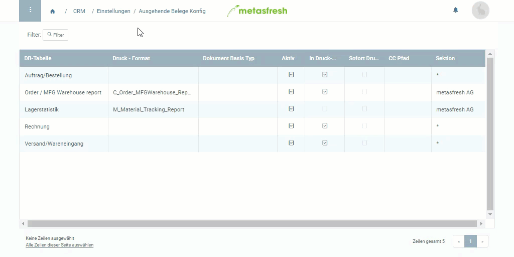

## Übersicht
Du kannst die ausgehenden Belege für eine Vielzahl von Tabellen einrichten, damit die erstellten Belege, wie Rechnungen, Lieferscheine, Mahnbriefe usw., unter dem Menüpunkt "Ausgehende Belege" aufgelistet werden, wo Du dann entweder einzelne Belege der Reihe nach oder im Dutzend weiterverarbeiten kannst.

## Schritte
1. [Gehe ins Menü](Menu) und öffne den Link "Ausgehende Belege Konfig".
1. [Erstelle einen neuen Konfigurationseintrag](Neuer_Datensatz_Fenster_Webui).
1. Gib den Namen der **DB-Tabelle**, die Du konfigurieren möchtest, ein und wähle die entsprechende Tabelle aus den Vorschlägen aus, z.B. "Mahnung".
1. Wähle ein **Druck-Format**.
1. Stelle sicher, dass bei dem Kästchen **In Druck-Warteschlange** ein Häkchen gesetzt ist, wenn Du die fertigen Belege ebenfalls an die Druckwarteschlange senden möchtest.
1. [metasfresh speichert automatisch](Speicheranzeige).

**Wichtig:** Damit die Änderungen auf dem Anwendungsserver aktiv werden, muss dieser erst vom Admin neugestartet werden.

## Beispiel

