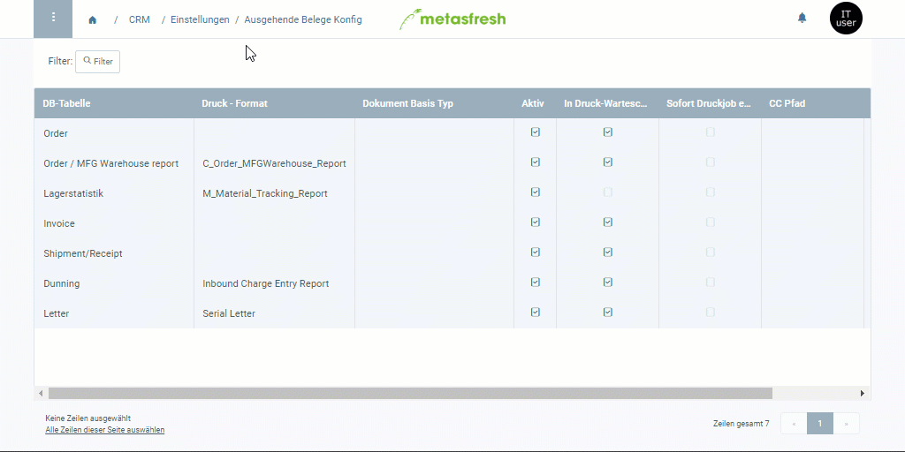

## Überblick
Du musst die ausgehenden Belege für die Serienbrief-Funktion einrichten, damit die erstellten Serienbriefe ebenfalls unter dem Menüpunkt "Ausgehende Belege" aufgelistet werden, wo Du sie dann entweder einzeln der Reihe nach oder kollektiv weiterverarbeiten kannst.

## Schritte
[Folge dieser Anleitung](Ausgehende_Belege_Konfig) und verwende die **DB-Tabelle** *Letter* und das **Druck-Format** *Serienbrief*.
 >**Hinweis:** Sollte das Druckformat nicht vorhanden sein, dann [lege ein neues an](Druckformat_anlegen) mit der **DB-Tabelle** *Letter* und dem **Jasper-Prozess** *Serial Letter*.

## Beispiel
<kbd></kbd>
