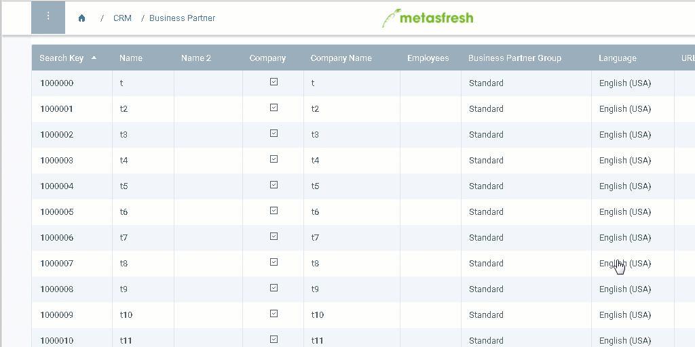

## Verschiedene Selektionsmöglichkeiten
- Halte `Strg` gedrückt, um mehrere einzelne Zeilen zu selektieren.
- Halte `⇧ Shift` gedrückt, um einen Zeilenbereich zu selektieren.
- Um alle Zeilen der aktuellen Seite zu selektieren, klicke auf *Alle Zeilen dieser Seite auswählen* in der unteren linken Ecke der Seite.
 >**Hinweis:** Drücke `Alt` + `A` / `⌥ alt` + `A`.

- Um die gesamten Zeilen aller Seiten zu selektieren, klicke auf *Wähle alle ## Zeilen* in der unteren linken Ecke der Seite.
 >**Hinweis 1:** Dieser Button erscheint erst, nachdem man *Alle Zeilen dieser Seite auswählen* geklickt hat.  
 >**Hinweis 2:** Drücke `Alt` + `A` / `⌥ alt` + `A`, um zwischen den letzten beiden Selektionsmöglichkeiten zu wechseln.

## Beispiel

