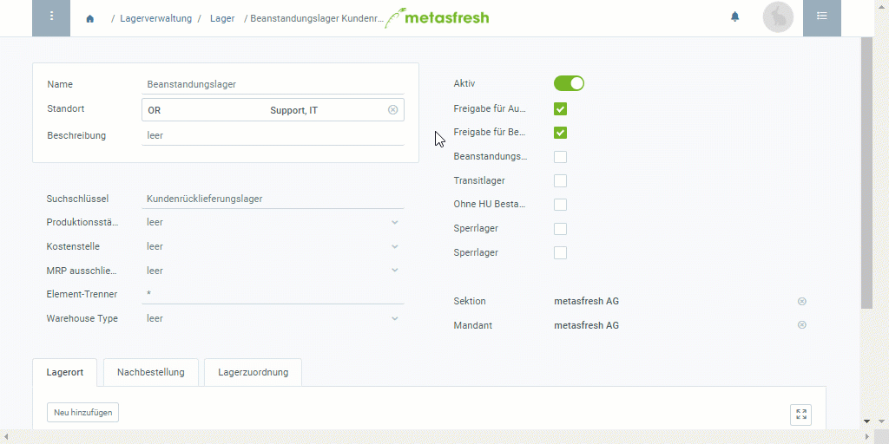

## Übersicht
Ein Beanstandungslager dient zur Lagerung von zurückgesandter Ware, die erst auf ihre Unversehrtheit und Vollständigkeit geprüft werden muss, bevor sie ggf. wieder in die normale Vertriebskette zurückgeführt werden darf.

## Schritte
1. Folge dieser [Anleitung zum Anlegen eines Lagers](Neues_Lager_anlegen) bis zum **Schritt 3 der Lagerorterfassung**.
1. Entferne die Häkchen bei den Feldern **Freigabe für Aufträge** und **Freigabe für Bestellungen**.
1. Setze jeweils ein Häkchen bei **Beanstandungslager**, **Sperrlager** und **Sperrlager**.
1. [metasfresh speichert automatisch](Speicheranzeige).

## Beispiel

