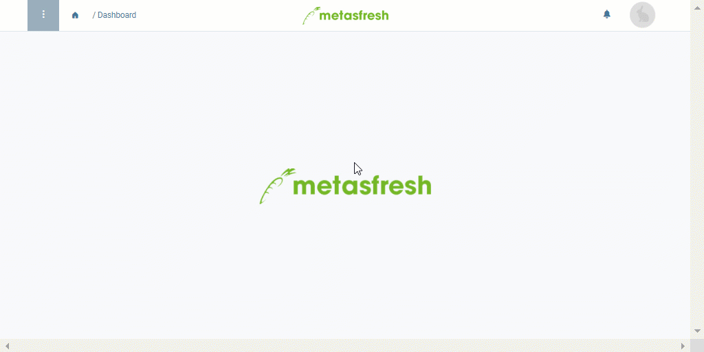

## Übersicht
In metasfresh kannst Du eigene Laufnummern für Belege definieren, die Du anschließend dann auch anderen Einträgen, wie z.B. [Produktkategorien](NeueProduktkategorie), zuordnen kannst, damit diese automatisch mit den individuellen Einstellungen fortlaufend nummeriert werden.

## Schritte
1. [Gehe ins Menü](Menu) und öffne das Fenster "Belegnummern".
1. [Erstelle einen neuen Eintrag](Neuer_Datensatz_Fenster_Webui).
1. Benenne den Belegnummerneintrag im Feld **Name**.
1. Setze ein Häkchen bei **Automatische Nummerierung**. Es erscheinen weitere Felder.
1. Das Feld **Aktuell nächster Wert** zeigt die jeweils nächste Zahl in der Reihenfolge an.
1. Das Feld **Increment** zeigt die Anzahl an, um die sich der nächste Wert bei Anwendung erhöht.
1. Das Feld **Decimal Pattern** bestimmt die Anzahl der Ziffern in der Nummerierung. Sie wird in Form von Nullen dargestellt.
 >**Hinweis:** Eine Zahlenfolge bestehend aus fünf Ziffern (z.B. 12345) würde hier durch "00000" dargestellt werden.

1. Mithilfe der Felder **Präfix** und **Suffix** kannst Du zusätzliche Konstanten (alphanumerische Zeichenfolgen) festlegen, die dann automatisch vor bzw. hinter der fortlaufenden Belegnummer eingefügt werden.
1. [metasfresh speichert automatisch](Speicheranzeige).

## Nächste Schritte (optional)
- [Richte eine individuelle Belegnummerierung mit Affixen ein](Belegnummern_anpassen).
- [Richte die Referenzzeile eines Auftrags als Belegnummer für Folgebelege ein](Referenz_als_Belegnummer).

## Beispiel

