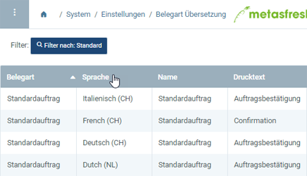
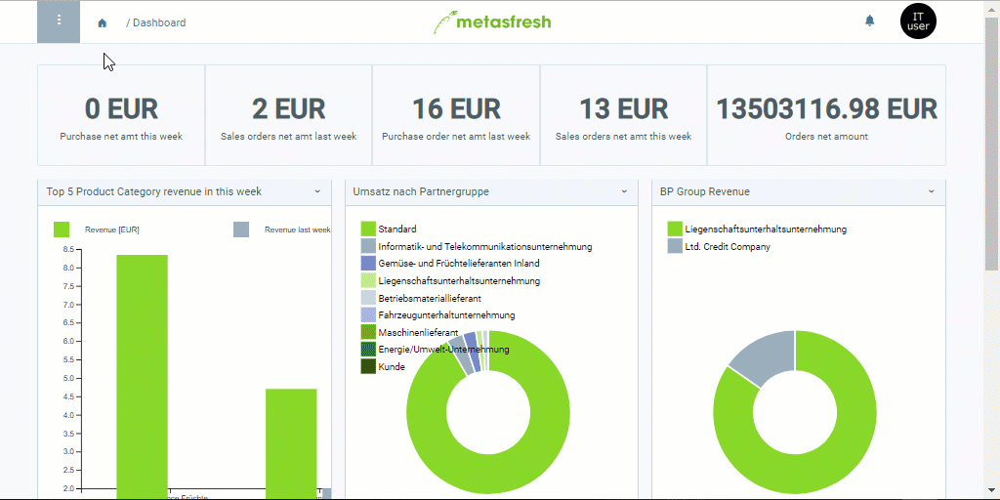

## Übersicht
In metasfresh kannst Du für jede Belegart (z.B. Angebot, Bestellung, Eingangsrechnung, Lieferschein, Standardauftrag usw.) [eigene Texte erfassen](Text_auf_Belege_drucken-Belegart) und diese eigenständig in die Sprachen Deiner Geschäftspartner übertragen, damit beim [Drucken von Belegen](PDFVorschau) für fremdsprachige Geschäftspartner die in deren Sprachen entsprechend verfassten Texte auf den Belegen aufgeführt werden.

## Schritte

### Übersetzungseintrag öffnen

#### a) Über das Navigationsmenü
1. [Gehe ins Menü](Menu) und öffne das Fenster "Belegart Übersetzung".
1. [Verwende die Filterfunktion](Filterfunktion), um denjenigen Eintrag zu finden, für den Du eine fremdsprachige Textversion anlegen möchtest. Für jede verfügbare Sprache gibt es einen eigenen Eintrag (siehe Tabellenspalte **Sprache**).  

#### b) Aus dem Eintrag über die Sidebar springen
Hast Du die Belegart, für die Du eine fremdsprachige Textversion anlegen möchtest, bereits geöffnet, dann gehe wie folgt vor:

1. [Springe über die verknüpften Belege](SpringezuBelegen) des Eintrages in das Fenster "Belegart Übersetzung" (unter SYSTEM in der Sidebar).
1. In diesem Fenster werden Dir alle Übersetzungseinträge für den ausgewählten Eintrag angezeigt.

### Fremdsprachige Textversionen anlegen
1. Öffne den Eintrag der Sprache, in der Du einen Text verfassen möchtest, z.B. "English (US)".
1. Gib in das Textfeld **Notiz / Zeilentext** die fremdsprachige Textversion ein, die am Ende des Beleges erscheinen soll.
1. Gib in das Textfeld **Beschreibung** die fremdsprachige Textversion ein, die am Anfang des Beleges erscheinen soll.
1. [metasfresh speichert automatisch](Speicheranzeige).

## Beispiel

