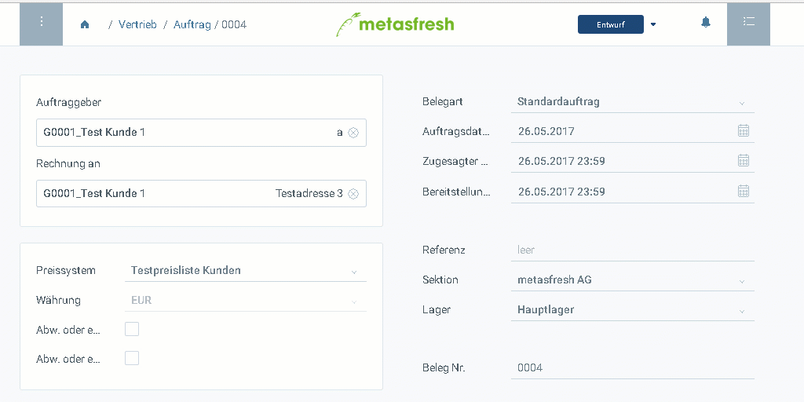

## Übersicht
Belege werden von metasfresh zwar [automatisch gespeichert](Speicheranzeige), jedoch erst verarbeitet, wenn diese fertiggestellt sind.

### Mit der Tastatur
Drücke die Tastenkombination `Strg + U`, um auf den Status auf "Fertiggestellt" zu setzen.

### Mit der Maus

Klicke auf den Button für die [Belegverarbeitung](AktionStarten) (`Ctrl + I`) oben rechts im Fenster und wähle dort "Fertigstellen" aus. 

## Beispiel

