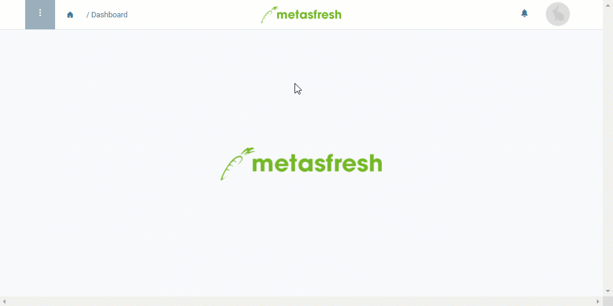

## Übersicht
metasfresh informiert Dich mittels Kurzmitteilungen über den Status Deiner Prozesse, damit Du stets auf dem neuesten Stand bist und rechtzeitig reagieren kannst. Die Art und Weise, wie Du benachrichtigt wirst, kannst Du ganz einfach im Nutzermenü einstellen. 
metasfresh bietet folgende Benachrichtigungsarten:

| Benachrichtigungsart | Erläuterung |
| :--- | :--- |
| Betreuer benachrichtigen | Der Betreuer erhält eine Benachrichtigung. |
| E-Mail | Der Nutzer erhält eine Benachrichtigung nur per E-Mail. |
| Statusmeldung | Der Nutzer erhält eine Benachrichtigung nur in der Nachrichtenbox . |
| E-Mail + Statusmeldung | Der Nutzer erhält eine Benachrichtigung sowohl per E-Mail als auch in der Nachrichtenbox . |
| Nichts | Es werden keine Benachrichtigungen versandt. |

## Schritte
1. Öffne rechts oben in der Menüleiste das Nutzermenü .
 >**Hinweis:** Drücke `Alt` + `4` / `⌥ alt` + `4`.

1. Klicke auf "Einstellungen".
1. Wähle links unten in dem Fenster die bevorzugte **Benachrichtigungsart** aus, z.B. *Statusmeldung*.
1. [metasfresh speichert automatisch](Speicheranzeige).

## Beispiel

