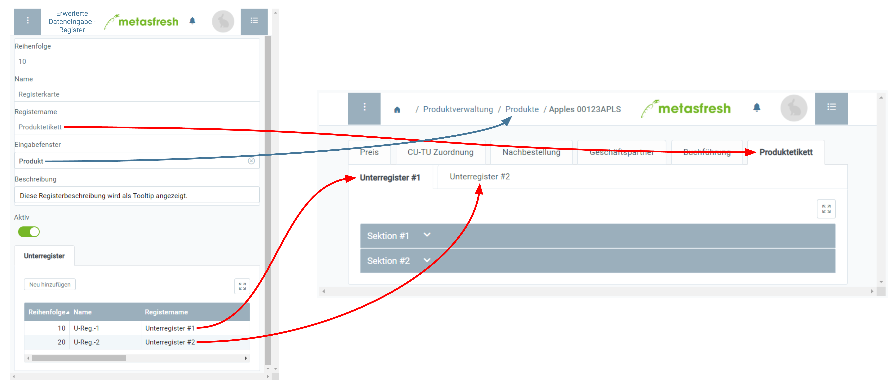

## Übersicht
In metasfresh kannst Du in verschiedenen Eingabefenstern benutzerdefinierte Registerkarten anlegen zur Erfassung eigener spezifischer Daten. Diese Daten lassen sich mithilfe von Unterregistern, Sektionen, Zeilen sowie Eingabefeldern organisieren und so auch in der Form von [Produktetiketten oder Typenschildern](Produktetikett_erstellen) ausdrucken.

## Schritte

### Registerkarte anlegen
1. [Gehe ins Menü](Menu) und öffne das Fenster "Erweiterte Dateneingabe - Register".
1. [Lege einen neuen Eintrag an](Neuer_Datensatz_Fenster_Webui).
1. Gib im Feld **Name** einen systeminternen Registerkartennamen ein.
 >**Hinweis:** Dieser Name dient nur der systeminternen Referenz und wird nicht als Registername angezeigt.

1. Benenne die Registerkarte im Feld **Registername**.
 >**Hinweis:** Dieser Name wird auf dem Registerreiter im Eingabefenster zu lesen sein.

1. Gib im Feld **Eingabefenster** einen Teil des Namens des [Fensters](Menu) ein, in dem die Registerkarte erscheinen soll, und klicke auf den passenden Treffer in der [Dropdown-Liste](Keyboard_Shortcuts_Liste), z.B. *Produkt*.
 >**Hinweis:** Bei mehreren benutzerdefinierten Registerkarten für dasselbe Eingabefenster kannst Du deren **Reihenfolge** bestimmen.

1. ***Optional:*** Erfasse eine **Beschreibung** in dem dafür vorgesehenen Textfeld.
 >**Hinweis:** Diese Beschreibung wird als Tooltip angezeigt werden.

### Unterregister hinzufügen
1. Gehe zur Registerkarte "Unterregister" unten auf der Seite und klicke auf . Es öffnet sich ein Overlay-Fenster.
1. Gib im Feld **Name** einen systeminternen Namen ein.
 >**Hinweis:** Dieser Name dient nur der systeminternen Referenz und wird nicht als Unterregistername angezeigt.

1. Benenne das Unterregister im Feld **Registername**.
 >**Hinweis:** Dieser Name wird auf dem Unterregisterreiter im Eingabefenster zu lesen sein.

1. ***Optional:*** Erfasse eine **Beschreibung** in dem dafür vorgesehenen Textfeld.
 >**Hinweis:** Diese Beschreibung wird als Tooltip angezeigt werden.

1. Klicke auf "Bestätigen", um das Overlay-Fenster zu schließen und das Unterregister zur Liste hinzuzufügen.
 >**Hinweis 1:** Wiederhole die Schritte 1 bis 5, um weitere Unterregister hinzuzufügen.  
 >**Hinweis 2:** Bei mehreren Unterregistern für dieselbe benutzerdefinierte Registerkarte kannst Du deren **Reihenfolge** bestimmen.

 

| **Wichtiger Hinweis:** |
| :--- |
| Die benutzerdefinierte Registerkarte wird erst in dem jeweiligen Eingabefenster angezeigt, wenn sie Sektionen und Felder beinhaltet. |

## Nächste Schritte
- [Füge den Unterregistern Sektionen hinzu](Unterregister_Sektion_hinzufuegen).

## Beispiel

