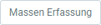
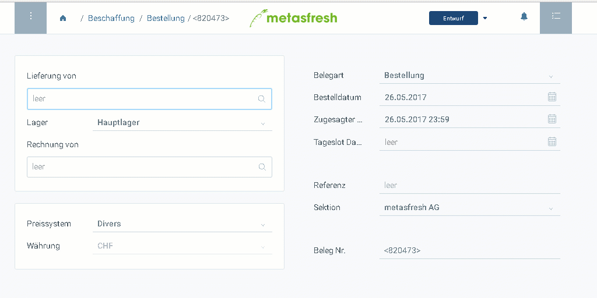

## Schritte
1. [Gehe ins Menü](Menu) und öffne das Fenster "Bestellungen".
1. [Lege eine neue Bestellung an](Neuer_Datensatz_Fenster_Webui).
1. ***Optional:*** Stelle unten rechts im Feld **Sektion** die gewünschte [Organisation](Org_Neue_Organisation_anlegen) ein. Gib dazu einen Teil des Organisationsnamens ein und klicke auf den passenden Treffer in der <a href="Keyboard_Shortcuts_Liste#dropdown" title="Dynamisches Suchfeld (Autocomplete)">Dropdown-Liste</a>.
1. Gib in das Feld **Lieferung von** einen Teil des Namens oder der Nummer des [Lieferanten](Neuer_Geschaeftspartner_Lieferant) ein und klicke auf den passenden Treffer in der <a href="Keyboard_Shortcuts_Liste#dropdown" title="Dynamisches Suchfeld (Autocomplete)">Dropdown-Liste</a>.
 >**Hinweis:** Wird der gewünschte Partner nicht angezeigt, kannst Du ihn per [Schnellerfassung](Neuer_Geschaeftspartner_Schnellerfassung) neu anlegen.

1. Wähle ein [**Preissystem**](Preissystem_anlegen) aus, sofern der Lieferant noch mit keinem [Preissystem verknüpft](Zuweisung_Preise_Partner) ist.
1. Das Feld **Datum** bestimmt den Zeitpunkt, an dem die Bestellung *aufgegeben* wurde.
1. Das Feld **Zugesagter Liefertermin** bestimmt, wann die Leistung *erbracht* werden soll bzw. die Bestellung zu erwarten ist.
1. [metasfresh speichert automatisch](Speicheranzeige).

### Bestellzeilen hinzufügen
1. Gehe zur Registerkarte "Bestellposition" unten auf der Seite und klicke auf , um die Bestellzeileneingabe zu öffnen.
 >**Hinweis:** Drücke `Alt` + `Q` / `⌥ alt` + `Q`.

1. Gib in das Feld **Produkt** einen Teil des Namens oder der Nummer des [Produktes](NeuesProdukt) ein und klicke auf den passenden Treffer in der <a href="Keyboard_Shortcuts_Liste#dropdown" title="Dynamisches Suchfeld (Autocomplete)">Dropdown-Liste</a>.
 >**Hinweis:** Verwende die [Liste der Produktvorschläge](Produktvorschlaege_Auftrag_Bestellung), um alle verfügbaren Produkte auf der aktuellen Preisliste zu sehen und ggf. eine Auswahl davon zur Bestellung hinzuzufügen.

1. Gib eine **Menge** ein.
 >**Hinweis:** Wechsle in das Feld mit der Maus oder `Tab ↹`-Taste.

1. Drücke `↵ Enter`, um die Zeile hinzuzufügen.
 >**Hinweis:** Wiederhole die Schritte 2 bis 4 so oft, bis Du alle Bestellzeilen erfasst hast.

### Bestellung fertigstellen
1. [Stelle den Beleg fertig](BelegverarbeitungFertigstellen).
1. [Öffne die PDF-Vorschau](PDFVorschau).

## Nächste Schritte
- [Erstelle einen Wareneingang](Zu_Bestellung_Wareneingang_erstellen) zu der Bestellung.

## Beispiel

