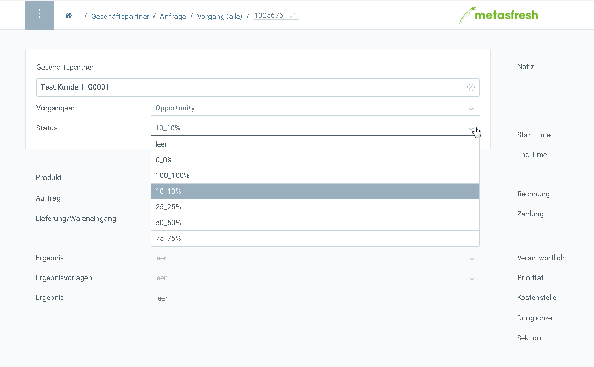

## Übersicht
Opportunities sind Verkaufsmöglichkeiten im Vertrieb die mit einer  prozentualen Wahrscheinlichkeit angegeben werden.

In metasfresh sind Opportunities als eine Vorgangsart abgebildet deren Status wie folgt sei kann:

| Status     | Beschreibung     |
| :------------- | :------------- |
| 10%        |  Anfangsstatus
| 25%,50%,75%| steigende Wahrscheinlichkeit
| 100% | gewonnen
| 0% | verloren

## Schritte

1. [Melde Dich an](Anmeldung)
1. [Öffne das Fenster "Vorgang"](Menu)
1. Wähle die Vorgangsart "Opportunity" aus
1. Pflege im Feld "Status" die jeweilige Wahrscheinlichkeit

## Screenshot

