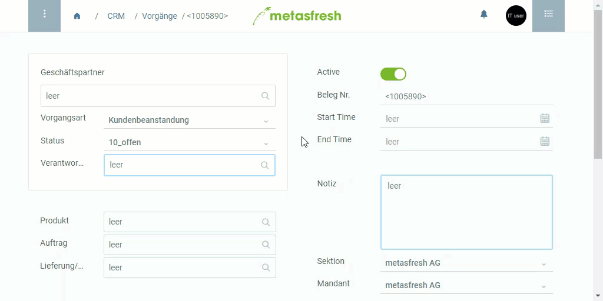

## Überblick
Opportunities sind potenzielle Verkaufsmöglichkeiten im Vertrieb, die mit einer prozentualen Wahrscheinlichkeit angegeben werden können.

In metasfresh werden Opportunities als eine *Vorgangsart* abgebildet, deren Status wie folgt sein kann:

| Status | Beschreibung |
| :--- | :--- |
| 10% | Ausgangspunkt |
| 25%, 50%, 75% | Steigende Wahrscheinlichkeit |
| 100% | Gewonnen |
| 0% | Verloren |

## Schritte
1. [Gehe ins Menü](Menu) und öffne das Fenster "Vorgänge".
1. [Lege einen neuen Vorgang an](Neuer_Datensatz_Fenster_Webui).
1. Gib unter **Geschäftspartner** einen Teil des Namens oder der Nummer des [Kunden](Neuer_Geschaeftspartner_Kunde) ein und klicke auf den passenden Treffer in der <a href="Keyboard_Shortcuts_Liste#dropdown" title="Dynamisches Suchfeld (Autocomplete)">Dropdown-Liste</a>.
1. Wähle die **Vorgangsart** *Opportunity* aus.
1. Wähle unter **Status** die jeweilige Wahrscheinlichkeit aus und passe sie ggf. aktuellen Änderungen an.
1. [metasfresh speichert automatisch](Speicheranzeige).

## Beispiel

