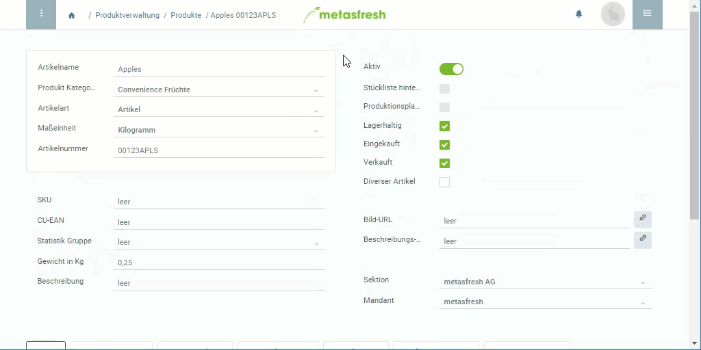

## Übersicht
Ein Produkt ist eine Verkaufseinheit (engl.: *Customer Unit - CU*), welche in größeren Mengen zu einem Gebinde (engl.: *Transport Unit - TU*) zusammengefasst werden kann. Die Art des Gebindes ist abhängig von der Packvorschrift.

## Schritte
1. Öffne ein bestehendes [Produkt](Menu) bzw. [lege ein neues an](NeuesProdukt).
1. Gehe zur Registerkarte "CU-TU Zuordnung" unten auf der Seite und klicke auf . Es öffnet sich ein neues Fenster.
1. Wähle eine **Packvorschrift Position** aus, z.B. *IFCO*.
1. ***Option 1:*** Trage eine bestimmte, immer gleichbleibende **Menge** ein, die in das Gebinde gepackt werden soll. Die **Maßeinheit** ist immer die Bestandsmengeneinheit des Produktes. 
***Option 2:*** Bei unbekannter bzw. wechselnder Menge setze ein Häkchen bei **Unbestimmte Kapazität**.
1. Stelle ein **Gültig ab** Datum ein.
 >**Hinweis:** Liegt das Datum in der *Vergangenheit*, gilt die Packvorschrift *ab sofort*. Liegt es in der *Zukunft*, gilt sie *erst ab diesem Datum*. metasfresh orientiert sich am zugesagten Termin in Auftrag oder Bestellung und schlägt dementsprechend die jeweilig gültige Packvorschrift vor.

1. Optional kannst Du einen **Geschäftspartner** angeben, wenn diese Packvorschrift nur für diesen einen Partner aktiviert werden soll.
1. Klicke auf "Bestätigen", um das Fenster zu schließen und die Zuordnung zur Liste hinzuzufügen.
 >**Hinweis:** Wiederhole die Schritte 2 bis 7, um weitere Zuordnungen mit anderen Packvorschriften zur Liste hinzuzufügen.

## Nächste Schritte
- Hänge die Packvorschrift an einen Preis

## Beispiel

