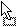
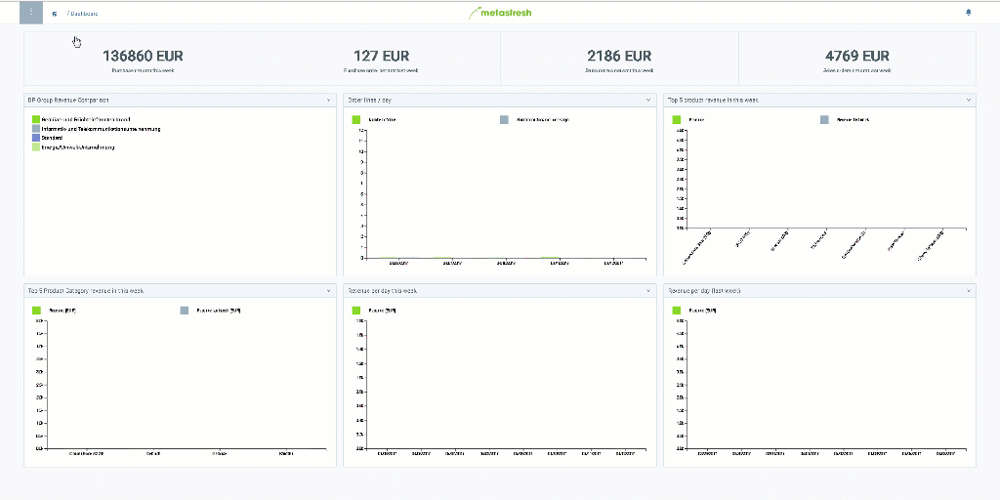

## Überblick
Das Dashboard von metasfresh ist eine Übersichtsseite, die automatisch nach der Anmeldung lädt. Dort werden Dir dynamische Daten in Echtzeit mittels verschiedener Widgets angezeigt.

Das Dashboard kannst Du auch nach eigenem Bedarf anpassen und Widgets hinzufügen, entfernen, verschieben und bearbeiten. Gehe hierzu wie folgt vor:

## Dashboard anpassen
1. [Melde Dich bei metasfresh an](Anmeldung) oder [gehe ins Menü](Menu) und öffne das Fenster "DASHBOARD".
1. Öffne das [Aktionsmenü](AktionStarten)  und klicke auf "Fenster anpassen". Es öffnet sich am rechten Seitenrand ein kleines Auswahlfenster mit den verfügbaren Widgets.
 >**Hinweis:** Drücke `Alt` + `O` / `⌥ alt` + `O`.

1. Um das Auswahlfenster wieder zu schließen und die Anpassung zu beenden, öffne erneut das [Aktionsmenü](AktionStarten) und klicke auf "Fenster speichern".

### Widgets hinzufügen
- Wähle aus dem Auswahlfenster ein Widget durch anklicken aus und ziehe es per *Drag and Drop*  an die gewünschte Stelle auf dem Dashboard.
 >**Hinweis:** Wenn ein Widget an einer bestimmten Stelle nicht abgelegt werden kann, verwandelt sich der Mauszeiger in dieses Symbol .

### Widgets entfernen
- Klicke einfach auf das kleine Löschsymbol  in der oberen rechten Ecke des Widgets, welches Du vom Dashboard entfernen möchtest.

### Widgets verschieben
- Wähle auf dem Dashboard ein Widget durch anklicken aus und ziehe es per *Drag and Drop* an eine andere Stelle auf dem Dashboard.

### Widgets bearbeiten
1. Klicke auf das kleine Zahnrad  in der oberen rechten Ecke des Widgets, welches Du bearbeiten möchtest. Es öffnet sich ein Overlay-Fenster.
1. Im Feld **Caption** kannst Du den Titel des Widgets ändern.
1. Klicke auf "Save", um die Änderungen zu übernehmen und das Overlay-Fenster zu schließen.

## Beispiel

