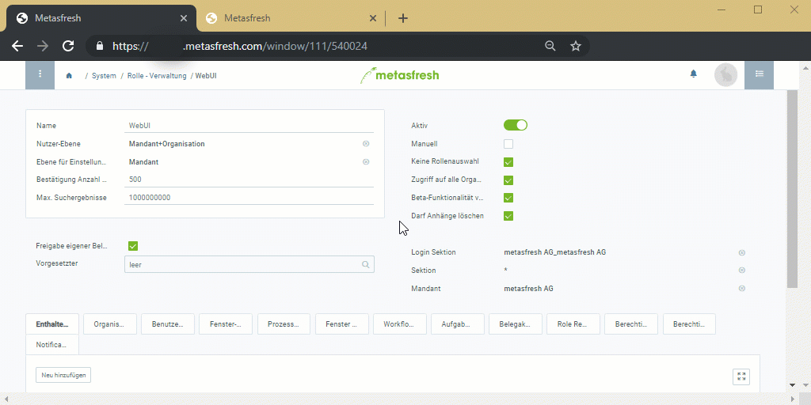

## Übersicht
In metasfresh kannst Du einstellen, dass nur bestimmte Benutzer die Erlaubnis haben, [Dateianhänge zu löschen](Dateihandling). Für alle anderen bleibt die Löschfunktion verborgen und sie können lediglich die Dateien öffnen und herunterladen. So wird verhindert, dass Dateien von nicht autorisierten Benutzern (versehentlich) gelöscht werden.

Beim Löschen eines Dateianhangs durch einen autorisierten Benutzer wird ein Eintrag im Änderungslog des Anhangs erstellt, u.a. mit dem Dateinamen sowie dem Namen des löschenden Benutzers. So kann stets festgestellt werden, von wem und zu welchem Zeitpunkt ein Dateianhang gelöscht wurde.

## Schritte

### Löschberechtigung einstellen
1. [Gehe ins Menü](Menu) und öffne das Fenster "Rolle - Verwaltung".
1. Öffne den Eintrag der [Benutzerrolle](NeueBenutzerrolle), für die Du die Löschberechtigung einstellen möchtest.
1. Setze ein Häkchen bei **Darf Anhänge löschen**, um der Benutzerrolle das Löschen von Dateianhängen zu erlauben oder entferne es, um ihr die Löschberechtigung wieder zu entziehen.
1. [metasfresh speichert automatisch](Speicheranzeige).

### Änderungslog einsehen
1. [Springe über die verknüpften Belege](SpringezuBelegen) des Dateneintrags, aus dem Du einen Dateianhang gelöscht hast, in das Fenster "Anhang Änderungslog" (unter SYSTEM in der Sidebar).
1. Hier findest Du für jeden Löschvorgang einen Log-Eintrag.

## Beispiel

