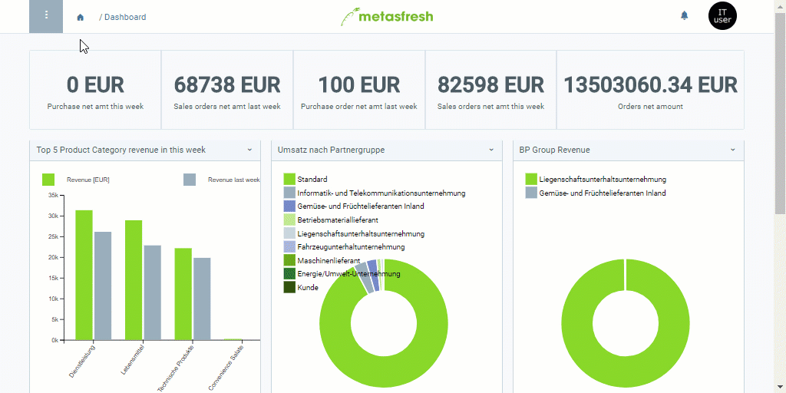

## Übersicht
Mit dem Druckformat kannst Du u.a. das Papierformat sowie das Seitenlayout, wie z.B. Hoch- oder Querformat, für Belege, die für den Druck bestimmt sind, festlegen.

## Schritte
1. [Gehe ins Menü](Menu) und öffne das Fenster "Druck - Format".
1. [Erstelle ein neues Druckformat](Neuer_Datensatz_Fenster_Webui).
1. Benenne das Druckformat im Feld **Name**.
1. Wähle eine **DB-Tabelle** aus, für die das Druckformat verwendet werden soll, z.B. *Letter*.
1. Wähle ein **Druck-Papier** aus, z.B. *A4 Portrait*.
1. Öffne die "[Erweiterte Erfassung](Ansichten)" aus dem [Aktionsmenü](AktionStarten).
 >**Hinweis:** Drücke `Alt` + `E` / `⌥ alt` + `E`.

1. Scrolle runter bis zum Feld **Jasper Process** und wähle einen geeigneten Prozess aus, z.B. *Serial Letter*.
 >**Hinweis:** Mittels Jasper werden die Belege bei ihrer Erstellung den Einstellungen entsprechend gestaltet.

1. Klicke auf "Bestätigen", um die Änderungen zu übernehmen und die "Erweiterte Erfassung" zu schließen.
1. [metasfresh speichert automatisch](Speicheranzeige).
  

| **Wichtiger Hinweis:** |
| :- |
| Damit die Einstellungen auf dem Anwendungsserver aktiv werden, muss dieser erst vom Admin neugestartet werden. |

## Beispiel

