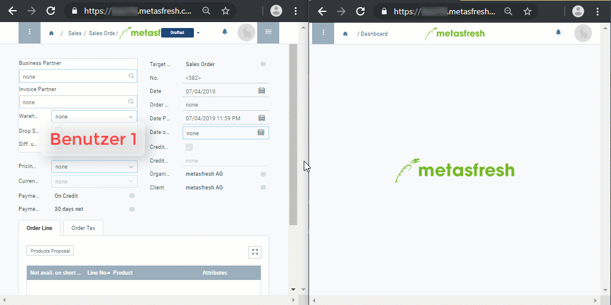

## Übersicht
In metasfresh hat jedes Fenster und jeder Beleg seine eigene, eindeutige ID bzw. einen eindeutigen Hyperlink, den Du mit Kollegen an anderen Standorten teilen kannst, sodass sie genau denselben Inhalt sehen können wie Du, vorausgesetzt sie verfügen über die gleichen Benutzerrechte.

Zum Beispiel kannst Du in einem Fenster in der Listenansicht eine Tabelle nach Datum filtern und den daraufhin erstellten Hyperlink aus der Adresszeile Deines Browsers kopieren und per E-Mail an eine bestimmte Person weiterleiten, welche diesen Link dann in ihrem Browser öffnen kann, um Dein Filterergebnis anzusehen.

Darüber hinaus können zwei oder mehrere Benutzer mit demselben Link zeitgleich in demselben Fenster arbeiten und die Eingaben des jeweils anderen Teamkollegen in Echtzeit mitverfolgen.
So ermöglicht metasfresh eine globale, simultane Zusammenarbeit im Team, wodurch sichergestellt wird, dass alle dieselben Daten einsehen können und keine unerwünschten Duplikate erstellt werden.

### Hyperlink-Austausch & Echtzeit-Fensteraktualisierung

