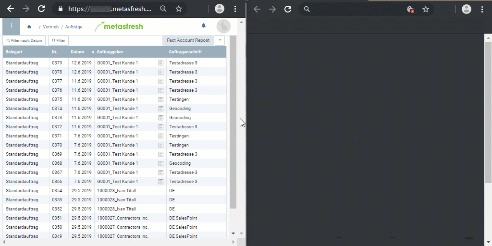

## Überblick
In metasfresh hat jedes Fenster und jeder Beleg seine eigene, eindeutige URL bzw. einen eindeutigen Hyperlink, den Du mit Kollegen an anderen Standorten teilen kannst, sodass sie genau denselben Inhalt sehen können wie Du, vorausgesetzt sie verfügen über die gleichen [Benutzerrechte](NeueBenutzerrolle).

Zum Beispiel kannst Du in einem Fenster in der [Listenansicht](Ansichten#listenansicht) eine Tabelle nach Datum [filtern](Filterfunktion) und den daraufhin erstellten Hyperlink aus der Adressleiste Deines Browsers kopieren und per E-Mail an eine bestimmte Person weiterleiten, welche diesen Link dann in ihrem Browser öffnen kann, um Dein Filterergebnis anzusehen.

Dazu kommt noch die [Echtzeit-Fensteraktualisierung von metasfresh](Echtzeit_Feature)!

### Eindeutige Fenster-URLs

