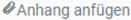
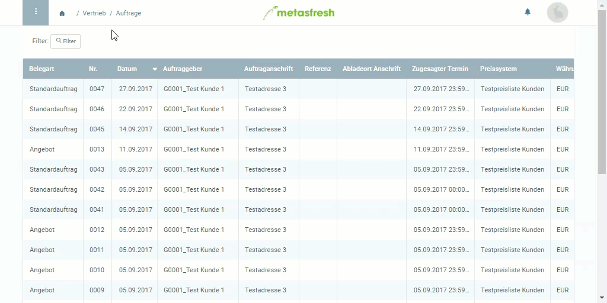

## Übersicht
In metasfresh kannst Du überall, wo Du mit einem Partner in Kontakt stehst (z.B. in einem Auftrag oder einer Bestellung), eine E-Mail direkt aus dem System an diesen Partner senden.

## Schritte
1. Öffne einen Eintrag, z.B. einen [Auftrag](Auftrag_erfassen).
1. Öffne das [Aktionsmenü](AktionStarten)  und klicke auf "E-Mail". Es öffnet sich der E-Mail-Editor.
 >**Hinweis 1:** Drücke alternativ `Alt` + `K` / `⌥ alt` + `K`, um den E-Mail-Editor zu öffnen.  
 >**Hinweis 2:** Der Name des Empfängers wird, sofern vorhanden, automatisch eingetragen.

1. Verfasse einen eigenen Text oder wähle im Textbausteinfeld oben rechts im E-Mail-Editor einen Textbaustein aus.
 >**Hinweis:** Das Textbausteinfeld erscheint nur, wenn mindestens ein Textbaustein unter dem Menüpunkt "[Textbaustein](Textbaustein_erstellen)" erfasst wurde.

1. Das referenzierte Dokument (z.B. der Auftrag) wird der E-Mail automatisch als Anhang beigefügt. Zusätzlich kannst Du über  unten links im E-Mail-Editor weitere Dokumente anhängen.
1. Klicke auf , um die E-Mail abzuschicken.

## Beispiel

