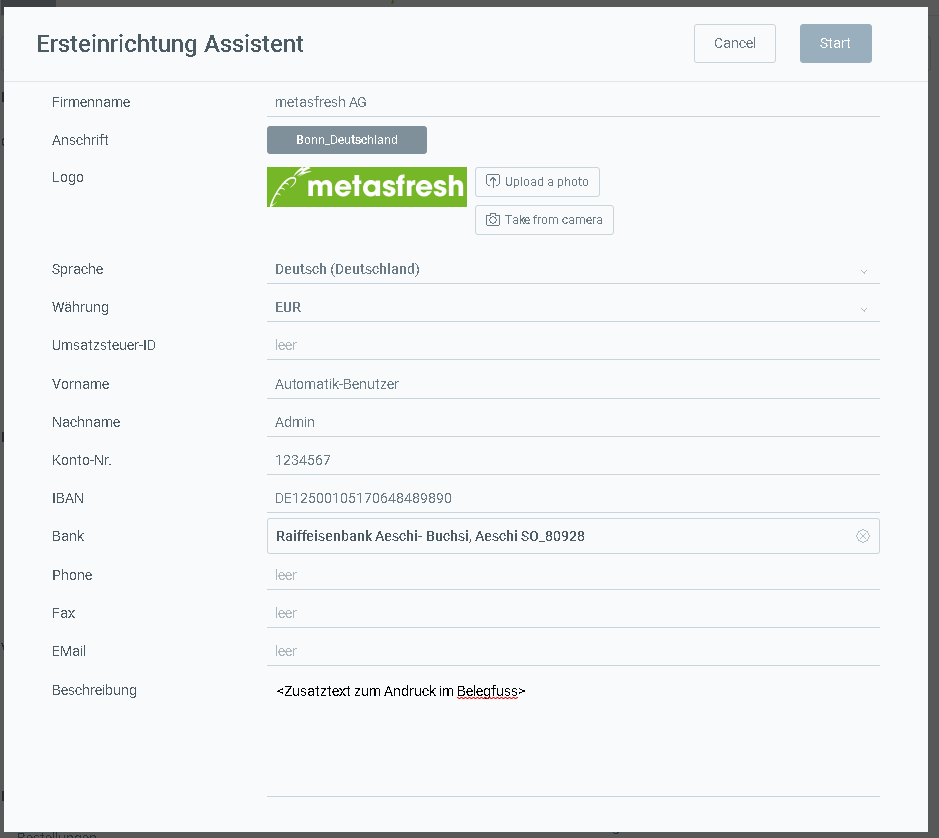

## Übersicht
Mit den folgenden Schritten kannst Du den bestehenden Mandanten "metasfresh", der standardmäßig enthalten ist, auf Deinen eigenen Firmennamen umändern.

## Schritte

1. Öffne "Ersteinrichtung Assistent" im [Menü](Menu).
1. Lade ein Logo über **upload a photo** hoch.
 >**Hinweis:** Das Logo sollte nicht größer als 200x200 Pixel sein, um eine optimale Passform für die Belege zu haben.

1. Fülle die gewünschten Felder aus.
1. Klicke auf "Start", um die Änderungen zu übernehmen und das Fenster zu schließen.
 >**Hinweis:** Du kannst den Assistenten beliebig oft verwenden, um die Firmendaten anzupassen.

## Beispiel

