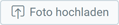
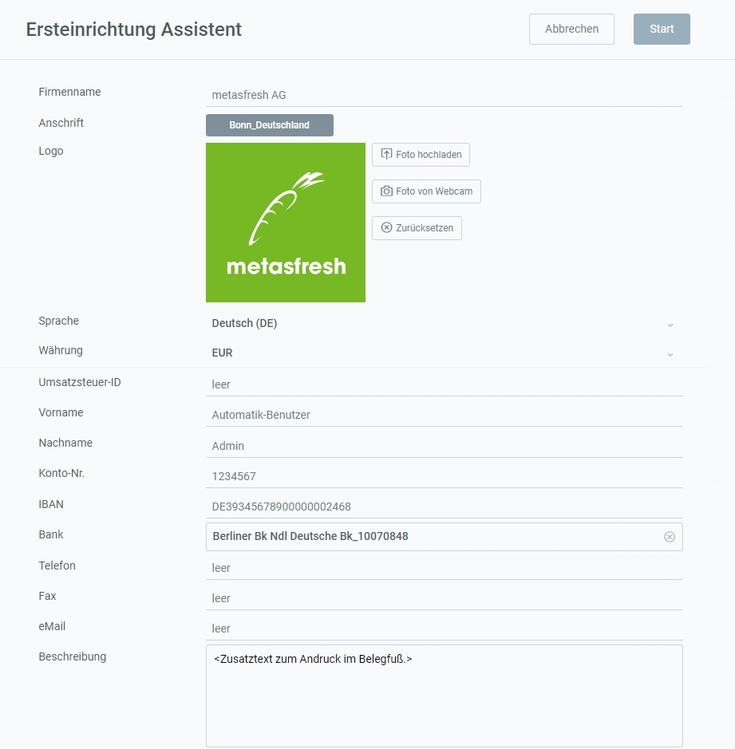

## Überblick
Mit den folgenden Schritten kannst Du die Daten des bestehenden Mandanten "metasfresh", der standardmäßig enthalten ist, mit Deinen eigenen Firmendaten ersetzen. Die Kontaktdaten (Anschrift, E-Mail, Bankverbindung usw.) erscheinen dann auf allen Belegen sowohl in der Adresszeile als auch am Belegfuß.

Weitere Informationen darüber, wie Du eigenen Text in Belege einfügen kannst, gibt es [hier](Text_auf_Belege_drucken-allgemein).

## Schritte
1. [Gehe ins Menü](Menu) und öffne das Fenster "Ersteinrichtung Assistent".
1. Trage in das Feld **Firmenname** den Namen Deiner Firma ein, wie er auf Belegen erscheinen soll.
1. Erfasse die **Anschrift** Deiner Firma, wie sie auf Belegen erscheinen soll.
 >**Hinweis 1:** Es muss mindestens das Land angegeben werden, damit die Einstellungen korrekt gespeichert werden können.  
 >**Hinweis 2:** Zur einheitlichen Bestimmung von Daten und Terminen auf internationaler Ebene kannst Du die [maßgebende Zeitzone einer Organisation festlegen](Org_Zeitzone_einstellen).

1. Lade ein **Logo** über  oder  hoch.
 >**Hinweis 1:** Das Logo sollte 2650 x 300 Pixel groß sein, um eine optimale Passform für die Belege zu haben.  
 >**Hinweis 2:** Um das Foto wieder zu entfernen, klicke einfach auf .

1. Wähle eine **Sprache** aus.
1. Wähle eine **Währung** aus, die in metasfresh als Stammwährung verwendet werden soll.
1. Fülle die weiteren Felder nach Bedarf aus, z.B. **Umsatzsteuer ID**, **Konto-Nr.**, **IBAN** usw.
 >**Hinweis:** Das Textfeld **Beschreibung** ist auf 90 Zeichen beschränkt.

1. Klicke auf "Start", um die Änderungen zu übernehmen und den Einrichtungsassistenten zu schließen.
 >**Hinweis:** Du kannst den Assistenten beliebig oft aufrufen, um die Firmendaten anzupassen.

 

| **Hinweis:** |
| :--- |
| Den gesamten Geschäftspartnereintrag mit Deinen Firmendaten findest Du unter dem Menüpunkt "[Organisation Stammdaten](Menu)" wieder. |

## Beispiel
<kbd></kbd>
