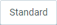
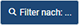

## Übersicht
Wenn Du in einem Fenster nach ganz bestimmten Einträgen suchst (wie z.B. nach [Geschäftspartnern](Neuer_Geschaeftspartner), [Aufträgen](Auftrag_erfassen), [Produkten](NeuesProdukt) usw.), kannst Du Dir diese gezielt mithilfe der Filterfunktion anzeigen lassen.

## Schritte
1. Öffne das Fenster Deiner Wahl in der [Listenansicht](Ansichten), z.B. "[Aufträge](Menu)".
1. Klicke auf  oben links im Fenster, um die Filtermaske zu öffnen, und dann auf .
1. Trage die gewünschten Stichwörter in die Suchfelder ein und/oder wähle die gewünschten [Attribute](Attribute_GP_hinzufuegen) aus, nach denen Du die Tabelle filtern möchtest, und klicke auf .
 >**Hinweis:** Drücke `Alt` + `↵ Enter` / `⌥ alt` + `↵ Enter`, um die Filterkriterien anzuwenden.

1. Um die Suchfelder wieder zu leeren, klicke auf  und dann auf  in der oberen rechten Ecke der Filtermaske.

## Nächste Schritte (optional)
- [Verwende die Umkreissuche, um die Filterergebnisse auf einen bestimmten geografischen Bereich zu beschränken](Umkreissuche_Geocoding).

## Beispiel

