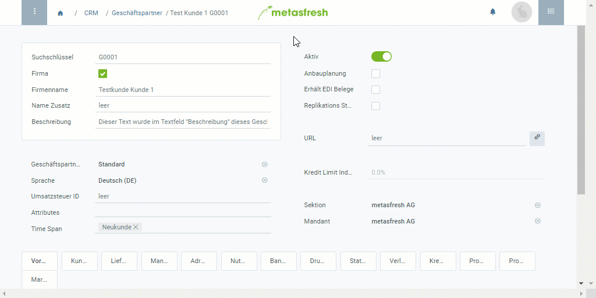

## Übersicht
In metasfresh kannst Du besondere Notizen mit Informationen von potenzieller Wichtigkeit über einen Geschäftspartner erfassen, welche in Form eines Tooltips in [Aufträgen](Auftrag_erfassen) und [Bestellungen](Bestellung_erfassen) durch Klicken auf das Tooltip-Symbol  rechts neben dem Partnernamen schnell eingesehen werden können.

## Schritte
1. Öffne den Eintrag eines bestehenden [Geschäftspartners](Menu) bzw. [lege einen neuen an](Neuer_Geschaeftspartner).
1. Öffne die "[Erweiterte Erfassung](Ansichten)" aus dem [Aktionsmenü](AktionStarten).
 >**Hinweis:** Drücke `Alt` + `E` / `⌥ alt` + `E`.

1. Scrolle runter bis zum Textfeld **Sonstiges** und gib hier eine Notiz ein, die als Tooltip angezeigt werden soll.
1. Klicke auf "Bestätigen", um die Änderungen zu übernehmen und die "Erweiterte Erfassung" zu schließen.
1. [metasfresh speichert automatisch](Speicheranzeige).

## Beispiel

