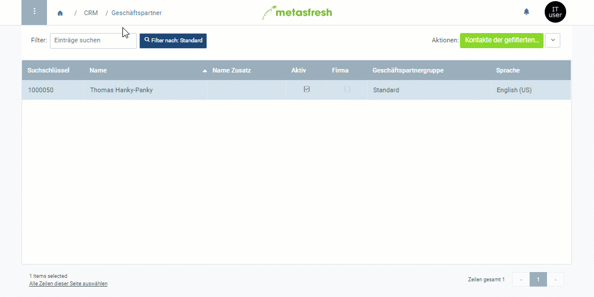

## Schritte
1. Öffne den Eintrag eines bestehenden [Geschäftspartners](Menu) bzw. [lege einen neuen an](Neuer_Geschaeftspartner).
1. Gehe zur Registerkarte "Nutzer / Kontakt" unten auf der Seite und klicke auf . Es öffnet sich ein Overlay-Fenster.
1. Wähle eine **Anrede** aus.
1. Fülle die Felder **Vorname** und **Nachname** aus.
1. ***Optional:*** Fülle die Felder **E-Mail** und **Telefon** sowie weitere Felder nach Bedarf aus.
1. Klicke auf "Bestätigen", um das Overlay-Fenster zu schließen und den Nutzer zur Liste hinzuzufügen.

### Weitere optionale Einstellungen
- Setze ein Häkchen bei **Verkaufskontakt**.
- Setze ein Häkchen bei **Einkaufskontakt**.
- Setze ein Häkchen bei **Rechnungskontakt**, um diesen Kontakt für den Empfang von Zahlungsaufforderungen verfügbar zu machen.
- Setze ein Häkchen bei **Lieferkontakt**.

| **Hinweis:** |
| :--- |
| Den neu erstellten Nutzereintrag findest Du unter dem Menüpunkt "[Nutzer](Menu)" wieder. |

## Beispiel
<kbd></kbd>
