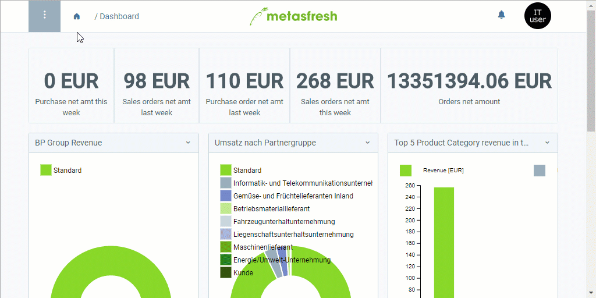

## Voraussetzungen
Stelle sicher, dass alle Voraussetzungen für den [Datenimport in metasfresh](Datenimport_in_metasfresh) erfüllt sind. [Hier findest Du ein Formatbeispiel für den Import von IFA-Herstellerdaten](Importformat_Beispiel_GPartner_Pharma).
 >**Hinweis:** Für den IFA-Herstellerdatenimport benötigst Du ein Importformat, in dem die **DB-Tabelle** *Import Pharma BPartners* eingestellt ist.

## Schritte
1. [Gehe ins Menü](Menu) und öffne das Fenster "Daten Import".
1. Öffne einen geeigneten Datenimporteintrag oder [lege einen neuen an](Datenimporteintrag_anlegen).

### Importdatei hochladen und importieren
1. [Lade Deine Importdatei mit den IFA-Herstellerdaten hoch](Dateihandling).
1. [Starte die Aktion](AktionStarten) "Import attachment". Es öffnet sich ein Overlay-Fenster.
1. Wähle im Feld **Anhang** die hochgeladene [Importdatei](Importdatei_nuetzliche_Hinweise) aus.
1. Klicke auf "Start", um die IFA-Herstellerdaten zu importieren und das Overlay-Fenster zu schließen.

### IFA-Herstellerdaten überprüfen
1. [Gehe ins Menü](Menu) und öffne das Fenster "Import Pharma BPartners". Hier findest Du alle importierten IFA-Geschäftspartnereinträge.
1. Öffne den Eintrag des IFA-Geschäftspartners, dessen Daten Du überprüfen und ggf. korrigieren möchtest.
 - Konnten beim Import alle Daten fehlerfrei übertragen werden, dann ist der IFA-Geschäftspartnereintrag hier schreibgeschützt und Du findest die importierten Daten unter dem Menüpunkt "[Geschäftspartner Pharma](Menu)" wieder, wo Du nun Änderungen vornehmen kannst.
 - Sollten einige Daten beim Import nicht oder fehlerhaft übertragen worden sein, kannst Du diese Fehler im jeweiligen IFA-Geschäftspartnereintrag unter "[Import Pharma BPartners](Menu)" korrigieren. Hast Du alle Fehler behoben, kannst Du die IFA-Herstellerdaten nun manuell importieren. Gehe hierzu wie folgt vor:

#### IFA-Herstellerdaten manuell importieren
1. [Starte die Aktion](AktionStarten) "IFA Hersteller importieren". Es öffnet sich ein Overlay-Fenster.
1. Klicke auf "Start", um die IFA-Herstellerdaten zu importieren und das Overlay-Fenster zu schließen.
1. Die importierten IFA-Herstellerdaten findest Du nun unter dem Menüpunkt "[Geschäftspartner Pharma](Menu)" wieder.

## Beispiel

