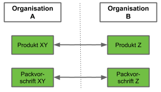

## Überblick
metasfresh ermöglicht Dir nicht nur die Verwaltung mehrerer juristischer Personen in einem System mittels [Organisationen](Org_Neue_Organisation_anlegen), sondern auch die automatische Erzeugung der jeweiligen Gegenbelege, wenn diese Organisationen miteinander Geschäfte abwickeln.

Gibt eine Organisation A ([Kunde](Neuer_Geschaeftspartner_Kunde)) bei einer Organisation B ([Lieferant](Neuer_Geschaeftspartner_Lieferant)) beispielsweise eine [Bestellung](Bestellung_erfassen) auf, so wird bei der Organisation B automatisch ein [Kundenauftrag](Auftrag_erfassen) der Organisation A angelegt und vice versa.

<kbd></kbd>

Damit nicht beide Organisation identische Produkte und Packmittel führen müssen, können die jeweils zueinander passenden Stammdaten miteinander verknüpft werden.

<kbd></kbd>

## Weitere Seiten zum Thema Gegenbelege



## Beispielablauf
1. Ein Benutzer aus der Org. A stellt eine Bestellung an Org. B fertig.
1. Automatisch wird bei Org. B ein Auftrag erzeugt mit Org. A als Kunden sowie den jeweils zugehörigen Produkten und Packvorschriften.
1. Der Auftrag bei der Org. B bleibt vorerst noch offen zwecks Sichtprüfung.

## Kontrolle
1. Einmal pro Tag versendet metasfresh eine Liste der erstellten Gegenbelege.
1. Sollte einmal ein Gegenbeleg nicht erstellt werden können, weil z.B. verknüpfte Stammdaten fehlen, erhältst Du eine entsprechende Fehlermeldung.
1. Gegenbelege, die nicht erstellt werden konnten, werden unter "[Fehlender/Unvollständiger Gegenbeleg](Menu)" aufgelistet. Um dieses Fenster zu sehen, musst Du Dich mit der [Benutzerrolle](NeueBenutzerrolle) "Admin" [bei metasfresh anmelden](Anmeldung).
