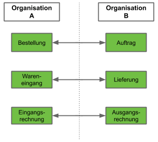

## Überblick

<kbd></kbd>

## Schritte
1. [Gehe ins Menü](Menu) und öffne das Fenster "Gegenbeleg".
1. [Erstelle einen neuen Konfigurationseintrag](Neuer_Datensatz_Fenster_Webui).
1. Stelle im Feld **Sektion** die gewünschte [Organisation](Org_Neue_Organisation_anlegen) ein, für die die Konfiguration gelten soll. Gib dazu einen Teil des Organisationsnamens ein und klicke auf den passenden Treffer in der <a href="Keyboard_Shortcuts_Liste#dropdown" title="Dynamisches Suchfeld (Autocomplete)">Dropdown-Liste</a>.
 >**Hinweis:** Soll z.B., wie in der Abbildung oben dargestellt, bei einer von der Org. A ausgelösten Bestellung automatisch ein Auftrag bei der Org. B erzeugt werden, dann stelle hier die Org. A ein.

1. Benenne den Konfigurationseintrag im Feld **Name**, z.B. mit dem Zweck der Gegenbelegserstellung wie "Auftrag bei Bestellung".
1. Wähle die [**Belegart**](Belegart_neu_definieren) aus, für die ein Gegenbeleg erstellt werden soll, z.B. *Bestellung*.
1. Wähle im Feld **Counter Document Type** die Art des zu erstellenden Gegenbeleges aus, z.B. *Standardauftrag*.
1. Wähle im Feld **Belegverarbeitung** aus, wie der Gegenbeleg bei Erstellung automatisch verarbeitet werden soll, z.B. *Vorbereiten*.
1. [Gehe ins Menü](Menu) und suche nach dem Prozess "Belegarten verifizieren". Starte ihn, um die Gegenbelegskonfiguration zu validieren und Fehler auszuschließen.
1. [metasfresh speichert automatisch](Speicheranzeige).

## Weitere Seiten zum Thema Gegenbelege


