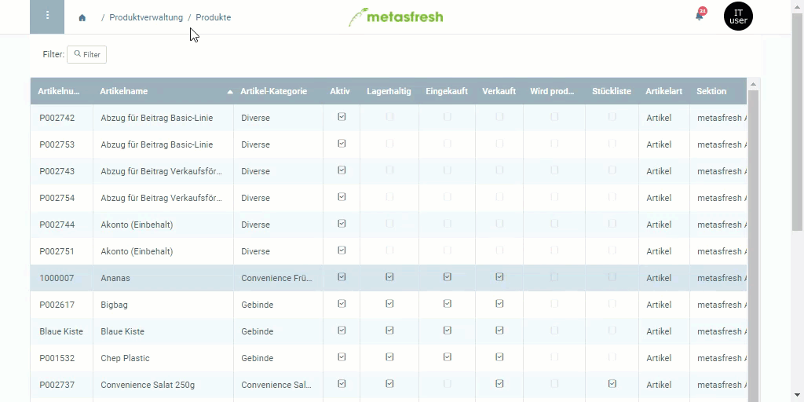

## Schritte
1. Öffne den Eintrag eines bestehenden [Produkts](Menu) bzw. [lege ein neues an](NeuesProdukt).
1. Gehe zur Registerkarte "Geschäftspartner" unten auf der Seite.
1. Öffne die "[Erweiterte Erfassung](AdvancedEditTab_Öffnen)" des [verknüpften](Produkt_mit_Geschaeftspartner_verknuepfen) [Lieferanten](Neuer_Geschaeftspartner_Lieferant).
1. Setze ein Häkchen bei **Gegenwärtiger Lieferant**.
1. Klicke auf "Bestätigen", um die Änderungen zu übernehmen und die "Erweiterte Erfassung" zu schließen.

## Beispiel

