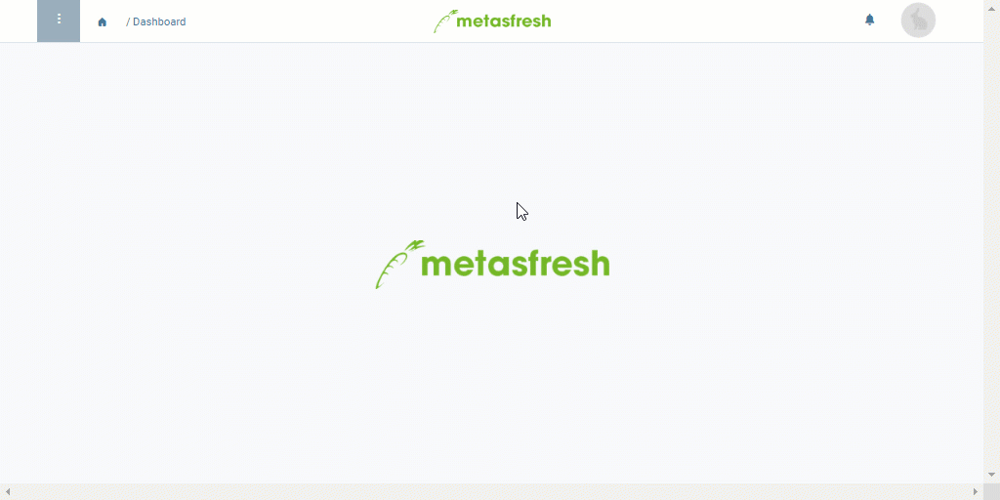

## Überblick
Ein Gruppierungsprodukt ist ein technisches Hilfsmittelprodukt, welches in [Aufträgen](Auftrag_erfassen) und [Angeboten](Angebot_erstellen) dazu dient, mehrere Auftragszeilen zu Kompensationsgruppen zusammenzufassen, um sie anschließend gemeinsam weiterzuverarbeiten.

Bei der [Gruppenrabattierung](Auftragszeilengruppenrabatt) zum Beispiel kommt es als [*Rabattprodukt*](Kompensationsgruppen_manuell_erstellen) zur Anwendung, um die selektierten Auftragszeilen zu gruppieren und dann gemeinsam zu rabattieren oder aufzuschlagen.

Bei der [Erstellung von Stücklisten aufgrund eines Angebots](Stueckliste_bei_Auftragsgenerierung) dient das Gruppierungsprodukt dazu, Produktionsbestandteile als Angebotsgruppen auszuweisen, damit diese anschließend mittels der [manuellen Kompensationsgruppierung](Kompensationsgruppen_manuell_erstellen) zu einem neuen Verkaufsprodukt mit Stückliste vereint werden können.

Grundsätzlich wird ein Gruppierungsprodukt wie jedes andere normale [Produkt](NeuesProdukt) auch angelegt, unter Berücksichtigung der folgenden anwendungsspezifischen Konfiguration:

## Schritte
1. [Gehe ins Menü](Menu) und öffne das Fenster "Produkte".
1. [Lege ein neues Produkt an](Neuer_Datensatz_Fenster_Webui).
1. Trage in das Feld **Name** einen sinnvollen Namen ein, z.B. "Rabatt".
1. Wähle eine geeignete [**Produktkategorie**](NeueProduktkategorie) aus, z.B. *Gruppierungsprodukt*.
1. Entferne das Häkchen bei **Lagerhaltig**.
1. [Füge das Produkt einer Preisliste hinzu](ProduktPreis).

| **Wichtig!** |
| :--- |
| Das Gruppierungsprodukt darf ***nicht lagerhaltig*** sein und muss mit ***derselben Preisliste*** verknüpft sein wie der Auftrag, in dem es zum Einsatz kommen soll! |

### Aktivierung für Angebotsgruppierung
1. Öffne die "[Erweiterte Erfassung](Ansichten)" aus dem [Aktionsmenü](AktionStarten).
 >**Hinweis:** Drücke `Alt` + `E` / `⌥ alt` + `E`.

1. Scrolle runter bis zum Kontrollkästchen **Ist Angebotsgruppe** und setze dort ein Häkchen.
 >**Hinweis:** Dadurch weiß metasfresh, dass es sich bei den gruppierten Produkten um eine Angebotsgruppe handelt.

1. Klicke auf "Bestätigen", um die Änderungen zu übernehmen und die "Erweiterte Erfassung" zu schließen.
1. [metasfresh speichert automatisch](Speicheranzeige).

## Nächste Schritte (optional)
- [Lege ein Kompensationsgruppenschema mit dem Gruppierungsprodukt an](Kompensationsgruppenschema_anlegen).
- [Gib einen Rabatt oder Zuschlag auf manuell erstellte Kompensationsgruppen](Auftragszeilengruppenrabatt).
- [Gib einen Rabatt oder Zuschlag auf automatisch erstellte Kompensationsgruppen](Auftragszeilengruppenrabatt).
- [Nutze das Gruppierungsprodukt zur Erstellung von Stücklisten bei der Auftragsgenerierung aus einem Angebot](Stueckliste_bei_Auftragsgenerierung).

## Beispiel

