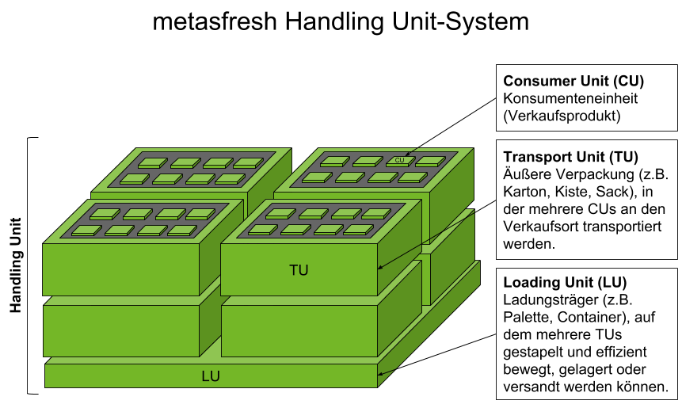

## Übersicht
metasfresh ermöglicht es Dir, Produkte nicht nur ohne Weiteres mit ihrer Gesamtmenge im Bestand zu führen, sondern sie auch ihren individuellen Eigenschaften entsprechend zu verwalten und demnach abzubilden, in welcher Form sie konkret vorliegen.

So kann Fertigsalat in Tüten zu 10 Stück in einer Kiste verpackt sein, von der wiederum 20 Stück auf einer Palette stehen.

Dieses System, Produkte (sog. Konsumenteneinheiten, engl.: *Consumer Units* = CU) mitsamt ihren Gebinden bzw. Verpackungen (engl.: *Transport Units* = TU) sowie deren Ladehilfsmitteln (engl.: *Loading Units* = LU) abzubilden, nennen wir **Handling Unit-System**.

Demzufolge bezeichnen wir das Gefüge aus einer CU in einer TU in/auf einer LU also als **Handling Unit (HU)**.

## Beispiele

| HU-Komponente | Art | Beispiel |
| :---: | :---: | :--- |
| CU | Produkt | Stückgut (z.B. Salatkopf), Schüttgut (z.B. Sand) oder Flüssiggut (z.B. Milch) |
| TU | Verpackung | Einwegbehälter, Mehrwegbehälter (z.B. Eurokisten, IFCO-Kisten), Aufsteller, Getränkekisten usw. |
| LU | Ladehilfsmittel | Paletten, Container, PALOXE usw. |

## Einrichtung

| HU-Komponente | Konfiguration |
| :---: | :--- |
| CU | [Wie konfiguriere ich ein Produkt für die Nutzung im Gebinde?](CU-TU_Zuordnung) |
| TU | [Wie erstelle ich eine Packvorschrift?](Packvorschrift_erstellen) |
| LU | Wie weise ich eine LU einer Packvorschrift zu? |

## Begriffsklärung

| Begriff | Beantwortet diese Fragen |
| :--- | :--- |
| CU (Consumer Unit) | Was ist mein [Produkt](NeuesProdukt)? |
| TU (Transport Unit) | In welcher Verpackung befindet sich mein Produkt? |
| LU (Loading Unit) | Welches Ladehilfsmittel wird verwendet? |
| [Packvorschrift](Packvorschrift_erstellen) | Welche Anforderungen gelten für eine Verpackung? |
| [Packmittel](Packmittel_einrichten) | Aus welchem Packmittel besteht die Verpackung? |
| Packgut | Darf ich in diese Verpackung auch ein Produkt tun? |
| VirtualPI | Ist die HU eine physische Verpackung oder eine virtuelle? |
| Handling Unit Typ | Handelt es sich um eine VirtualPI, TU oder LU? |
