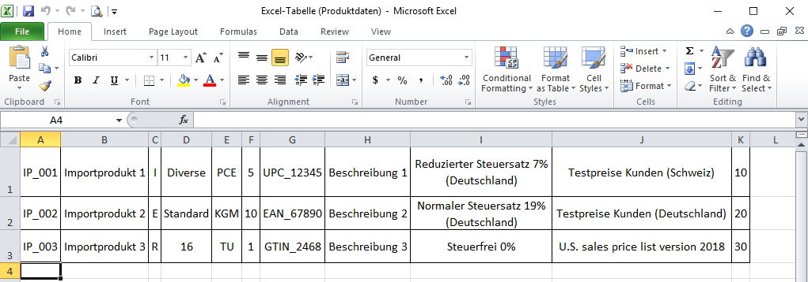
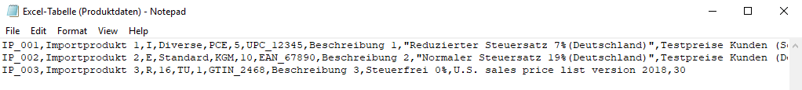

## Überblick
Damit Du extern gespeicherte Daten in metasfresh importieren kannst, musst Du sie erst entsprechend formatiert als CSV- oder TXT-Datei hochladen und kannst sie dann einfach über das [Aktionsmenü](AktionStarten#aktionsmenue) importieren.

Hier sind ein paar Formatbeispiele für den Import von:
- [Bankauszugsdaten](Importformat_Beispiel_Bankauszug)
- [Benutzerdefinierten Dateneingaben](Importformat_Beispiel_Dateneingabe)
- [Geschäftspartnerdaten](Importformat_Beispiel_GPartner)
- [IFA-Herstellerdaten](Importformat_Beispiel_GPartner_Pharma)
- [IFA-Produktdaten](Importformat_Beispiel_Produkt_Pharma)
- [Kontenrahmendaten](Importformat_Beispiel_Kontenrahmen)
- [Nachbestelldaten](Importformat_Beispiel_Nachbestellung)
- [Nutzerdaten](Importformat_Beispiel_Nutzer)
- [Postalische Daten](Importformat_Beispiel_postalische_Daten)
- [Produktdaten](Importformat_Beispiel_Produkt)
- [Rabattschemadaten](Importformat_Beispiel_Rabattschema)
- [Vertragsdaten](Importformat_Beispiel_Vertragsdaten)

## Nützliche Hinweise
Bitte achte bei der Erstellung einer Importdatei auf Folgendes:

- Das **Trennzeichen** in der Importdatei muss mit demjenigen aus dem [Importformat](Importformat_anlegen) übereinstimmen (Komma, Tabulatorzeichen, Semikolon usw.).
- Möchtest Du eine Importdatei mit dem **Komma** als Trennzeichen erstellen und verwendest dazu eine Tabellenkalkulationssoftware wie z.B. *Microsoft Excel*, dann wähle beim Speichern einfach das Dateiformat `CSV (Trennzeichen-getrennt)(*.csv)` aus.
- Möchtest Du eine Importdatei mit dem **Tabulatorzeichen** als Trennzeichen erstellen und verwendest dazu eine Tabellenkalkulationssoftware wie z.B. *Microsoft Excel*, dann wähle beim Speichern einfach das Dateiformat `Text (Tabstopp-getrennt)(*.txt)` aus.
- Die Positionen der Spalten in der Importdatei müssen den Werten der **Startnummern** der Formatfelder des Importformats entsprechen. 
***Beispiel:*** Die **Spalte C** der Excel-Tabelle steht an dritter Stelle, d.h. das entsprechende Formatfeld bekommt die **Start-Nr. 3**.
 >**Hinweis:** metasfresh erwartet ***keine Spaltennamen*** in der Importdatei. Alleine die ***Position*** der Spalte muss mit der Startnummer übereinstimmen.

## Nächste Schritte
- [Bankauszugsdaten importieren](Bankauszugsdaten_importieren).
- [Benutzerdefinierte Dateneingaben importieren](Dateneingaben_importieren).
- [Geschäftspartnerdaten importieren](GPartnerdaten_importieren).
- [IFA-Herstellerdaten importieren](GPartnerdaten_importieren_Pharma).
- [IFA-Produktdaten importieren](Produktdaten_importieren_Pharma).
- [Kontenrahmendaten importieren](Kontenrahmendaten_importieren).
- [Nachbestelldaten importieren](Nachbestelldaten_importieren).
- [Nutzerdaten importieren](Nutzerdaten_importieren).
- [Postalische Daten importieren](Postalische_Daten_importieren).
- [Produktdaten importieren](Produktdaten_importieren).
- [Rabattschemadaten importieren](Rabattschema_importieren).
- [Vertragsdaten importieren](Vertragsdaten_importieren)

## Beispiel: Excel-Tabelle (Produktdaten)

## Beispiel: CSV-Datei, Trennzeichen-getrennt (Produktdaten)

## Beispiel: TXT-Datei, Tabstopp-getrennt (Produktdaten)

