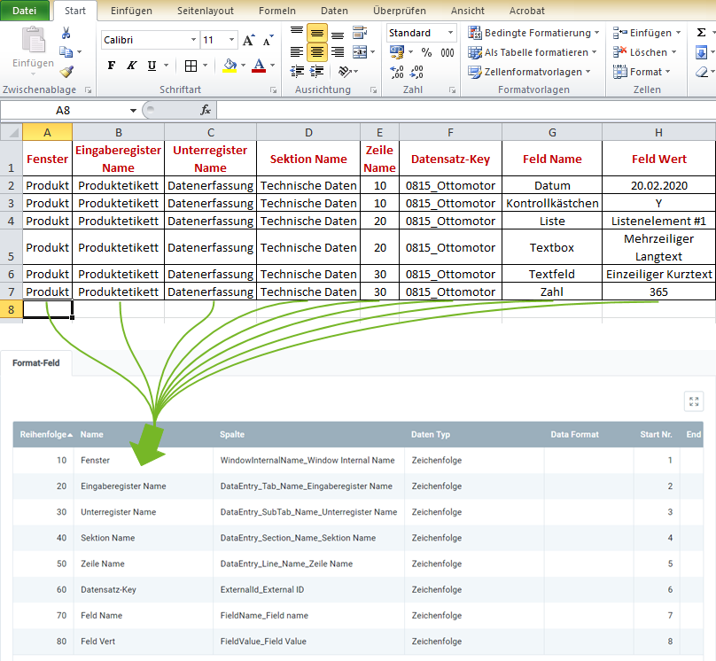

## Überblick
Für den Import [benutzerdefinierter Dateneingaben](Benutzerdefinierte_Registerkarte_anlegen) benötigst Du ein Importformat, in dem die **DB-Tabelle** *Import Data Entry Record* eingestellt ist.

In dem folgenden Beispiel wird der Dateninhalt aus einer Datei einer Tabellenkalkulationssoftware (hier z.B. eine *Excel*-Datei vor der [Konvertierung in eine CSV- oder TXT-Datei](Importdatei_nuetzliche_Hinweise)) dem Importformat für benutzerdefinierte Dateneingaben gegenübergestellt:

### Erläuterungen zum Beispiel
- Die **Spalte A** der Excel-Tabelle (*Fenster*) steht an erster Stelle, d.h. das entsprechende Formatfeld bekommt die **Start-Nr. 1**. Demzufolge erhält das Formatfeld für die **Spalte B** die **Start-Nr. 2** usw.  Die **Reihenfolge** der Formatfelder ist dabei unerheblich.
 >**Hinweis:** metasfresh erwartet ***keine Spaltennamen*** in der Importdatei. Alleine die ***Position*** der Spalte muss mit der Startnummer übereinstimmmen.

- Der **Name** des Formatfeldes ist frei wählbar und muss nicht mit der Benennung der Spalte aus der Importdatei übereinstimmen.
- Die **Spalte** des Formatfeldes bestimmt, wohin metasfresh den Inhalt der Spalte aus der Importdatei übertragen soll.
- Der **Datentyp** bestimmt, ob es sich bei den Importdaten z.B. um eine *Zeichenfolge* oder *Zahl* handelt.

### Einige nützliche Hinweise
Die Angabe der Pflichtfelder ist unerlässlich für einen erfolgreichen Datenimport!

| Pflichtfeld | Feldname | Beispiel | Hinweis |
| :---: | :---: | :--- | :--- |
| X | Fenster | Produkt | Systeminterner Name des Eingabefensters. (Im Zweifel beim Systemadministrator erfragen.) |
| X | Eingaberegister Name | Produktetikett | Name der benutzerdefinierten Registerkarte |
| X | Unterregister Name | Datenerfassung | Name des Unterregisters |
|  | Sektion Name | Technische Daten | Name der Sektion |
|  | Zeile Name | • 10  • 20  • ... | Reihenfolge der Zeile |
| X | Datensatz-Key | 0815_Ottomotor | Suchschlüssel des Dateneintrags |
| X | Feld Name | Datum | Name des Feldes  (**Wichtiger Hinweis:** Bei mehreren Feldern mit demselben Namen ***müssen*** der Sektionsname und/oder die Reihenfolge der Zeile angegeben werden!) |
|  | Feld Wert | 20.02.2020 | Wert bzw. Inhalt des Feldes.  Für folgende Felddatentypen (siehe [Erweiterte Dateneingabe - Feld](Sektionszeilen_Felder_hinzufuegen)) können folgende Werte angegeben werden:  • Datum: `TT.MM.JJJJ`  • Kontrollkästchen: Y (`= aktiviert`), N (`= deaktiviert`)  • Liste: `Name des Listenelementes`  • Textbox: `Text (mehrzeilig)`  • Textfeld: `Text (einzeilig)`  • Zahl: `Zahlenwert`   Wird kein Feldwert angegeben, wird der ggf. vorhandene Feldinhalt in dem Eingaberegister gelöscht. |

## Nächste Schritte
- [Benutzerdefinierte Dateneingaben importieren](Dateneingaben_importieren).
