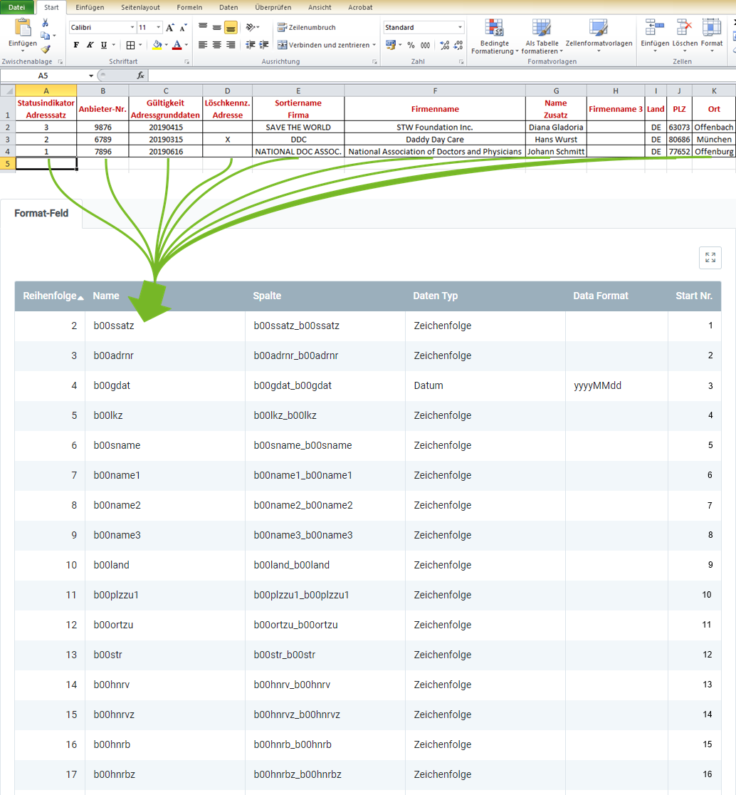

## Überblick
Für den Import von Herstellerdaten gemäß <a href="https://www.ifaffm.de/de/ifa-gmbh.html" title="Informationsstelle für Arzneispezialitäten" target="_blank">IFA GmbH</a> benötigst Du ein Importformat, in dem die **DB-Tabelle** *Import Pharma BPartners* eingestellt ist.

In dem folgenden Beispiel wird der Dateninhalt aus einer Datei einer Tabellenkalkulationssoftware (hier z.B. eine *Excel*-Datei vor der [Konvertierung in eine CSV- oder TXT-Datei](Importdatei_nuetzliche_Hinweise)) dem Importformat für IFA-Herstellerdaten gegenübergestellt:

### Erläuterungen zum Beispiel
- Die **Spalte A** der Excel-Tabelle (*Statusindikator Adresssatz*) steht an erster Stelle, d.h. das entsprechende Formatfeld bekommt die **Start-Nr. 1**. Demzufolge erhält das Formatfeld für die **Spalte B** die **Start-Nr. 2** usw.  Die **Reihenfolge** der Formatfelder ist dabei unerheblich.
 >**Hinweis:** metasfresh erwartet ***keine Spaltennamen*** in der Importdatei. Alleine die ***Position*** der Spalte muss mit der Startnummer übereinstimmmen.

- Der **Name** des Formatfeldes ist frei wählbar und muss nicht mit der Benennung der Spalte aus der Importdatei übereinstimmen.
- Die **Spalte** des Formatfeldes bestimmt, wohin metasfresh den Inhalt der Spalte aus der Importdatei übertragen soll.
- Der **Datentyp** bestimmt, ob es sich bei den Importdaten z.B. um eine *Zeichenfolge* oder *Zahl* handelt.

### Einige nützliche Hinweise
Die Angabe der Pflichtfelder ist unerlässlich für einen erfolgreichen Datenimport!
 >**Hinweis:** Ausführliche Informationen zu den Feldbedeutungen gibt es in der Produktbeschreibung der IFA-Informationsdienste (<a href="https://www.ifaffm.de/mandanten/1/documents/03_ifa_fuer_datenbezieher/Produktbeschreibung_10218-20218_lang.pdf" title="IFA-Informationsdienste Produktbeschreibung" target="_blank">PDF hier herunterladen und lesen</a>).

| Pflichtfeld | Feldname | Hinweis |
| :---: | :---: | :--- |
|  | b00ssatz | Statusindikator Adresssatz  (0=Bestand, 1=neu, 2=Wegfall, 3=Änderung) |
| X | b00adrnr | Adress-Nr. bzw. **Anbieter-Nr.** |
|  | b00gdat | Gültigkeit Adressgrunddaten |
|  | b00lkz | Löschkennzeichen Adresse |
|  | b00sname | Firma Sortiername (aus dem Firmennamen abgeleiteter Sortiername) |
| X | b00name1 | vollständiger Firmenname 1 (Geschäftspartnername) |
|  | b00name2 | vollständiger Firmenname 2 (Name Zusatz) |
|  | b00name3 | vollständiger Firmenname 3 |
|  | b00land | Land |
|  | b00plzzu1 | Postleitzahl für die Postzustellung (gültig in Verbindung mit "Ort Zustellung") |
|  | b00ortzu | Ortsangabe für die Postzustellung (gültig in Verbindung mit "PLZ Zustellung") |
|  | b00str | Straßenangabe für die Postzustellung (gültig in Verbindung mit "PLZ Zustellung", "Ort Zustellung" und Hausnummer(n)) |
|  | b00hnrv | Haus-Nr. von (gültig in Verbindung mit "Straße") |
|  | b00hnrvz | Zusatz zur "Haus-Nr. von" (z.B. 14 b) |
|  | b00hnrb | Haus-Nr. bis (bei Hausnummern wie z.B. 14 bis 18. Gültig in Verbindung mit "Haus-Nr. von") |
|  | b00hnrbz | Zusatz zur "Haus-Nr. bis" (z.B. bis 18 d) |
|  | b00plzpf1 | Postleitzahl zum Postfach (gültig in Verbindung mit "Postfach 1") |
|  | b00ortpf | Ortsangabe für das Postamt zum "Postfach" oder für Großkundenpostfächer (gültig in Verbindung mit "PLZ Postfach 1" oder "PLZ Großkunde 1") |
|  | b00pf1 | Postfach 1 |
|  | b00plzgk1 | Postleitzahl für Großkunden (gültig in Verbindung mit "Ort Postfach") |
|  | b00tel1 | Telefonnummer 1 der Auftragsannahme |
|  | b00tel2 | Telefonnummer 2 der Auftragsannahme |
|  | b00fax1 | Telefaxnummer 1 der Auftragsannahme |
|  | b00fax2 | Telefaxnummer 2 der Auftragsannahme |
|  | b00email | E-Mail-Adresse der Auftragsannahme |
|  | b00email2 | E-Mail-Adresse 2 der Auftragsannahme |
|  | b00homepag | Homepage der Firma |
|  | b00regnr9 | Registrierungs-Nr. gemäß § 9 Abs. 1 VerpackG |

## Nächste Schritte
- [IFA-Herstellerdaten importieren](GPartnerdaten_importieren_Pharma).
