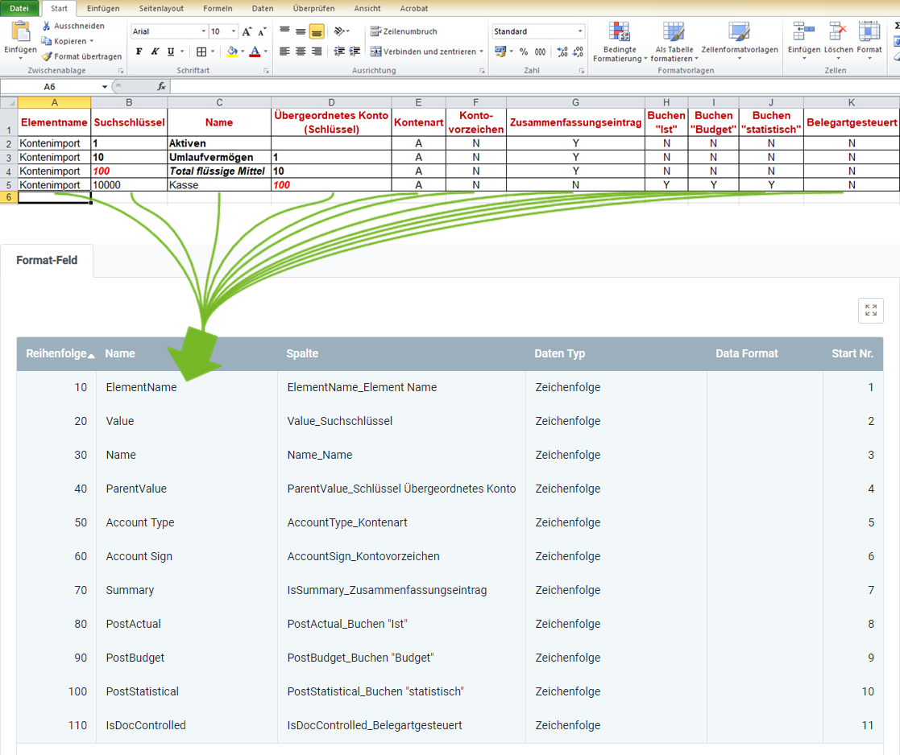

## Überblick
Für den Kontenrahmendatenimport benötigst Du ein Importformat, in dem die **DB-Tabelle** *Import - Kontendefinition* eingestellt ist.

In dem folgenden Beispiel wird der Dateninhalt aus einer Datei einer Tabellenkalkulationssoftware (hier z.B. eine *Excel*-Datei vor der [Konvertierung in eine CSV- oder TXT-Datei](Importdatei_nuetzliche_Hinweise)) dem Importformat für Kontenrahmendaten gegenübergestellt:

### Erläuterungen zum Beispiel
- Die **Spalte A** der Excel-Tabelle (*Elementname*) steht an erster Stelle, d.h. das entsprechende Formatfeld bekommt die **Start-Nr. 1**. Demzufolge erhält das Formatfeld für die **Spalte B** die **Start-Nr. 2** usw.  Die **Reihenfolge** der Formatfelder ist dabei unerheblich.
 >**Hinweis:** metasfresh erwartet ***keine Spaltennamen*** in der Importdatei. Alleine die ***Position*** der Spalte muss mit der Startnummer übereinstimmmen.

- Der **Name** des Formatfeldes ist frei wählbar und muss nicht mit der Benennung der Spalte aus der Importdatei übereinstimmen.
- Die **Spalte** des Formatfeldes bestimmt, wohin metasfresh den Inhalt der Spalte aus der Importdatei übertragen soll.
- Der **Datentyp** bestimmt, ob es sich bei den Importdaten z.B. um eine *Zeichenfolge* oder *Zahl* handelt.

### Einige nützliche Hinweise
Die Angabe der Pflichtfelder ist unerlässlich für einen erfolgreichen Datenimport!

| Pflichtfeld | Feldname | Beispiel | Hinweis |
| :---: | :---: | :--- | :--- |
| X | Elementname | Kontenimport | Benennung des Kontenrahmens |
| X | Suchschlüssel | 10 | Suchschlüssel des Rechnungsführungselementes (dient ebenfalls zur Gliederung der Elemente untereinander). |
| X | Name | Umlaufvermögen | Benennung des Rechnungsführungselementes |
|  | Übergeordnetes Konto (Schlüssel) | 1 | Suchschlüssel des übergeordneten (zusammenfassenden) Kontos (dient ebenfalls zur Gliederung der Elemente untereinander). |
|  | Kontenart | •&nbsp;A = Aktiven (engl.: _**a**ssets_)  •&nbsp;E = Aufwand (engl.: _**e**xpense_)  •&nbsp;O = Eigenkaptial (engl.: _**o**wner's equity_)  •&nbsp;R = Ertrag (engl.: _**r**evenue_)  •&nbsp;M = Notiz (engl.: _**m**emo_)  •&nbsp;L = Passiven (engl.: _**l**iabilities_) | Art des Kontos |
|  | Kontovorzeichen | •&nbsp;N = Natural  •&nbsp;C = Haben (engl.: _**c**redit_)  •&nbsp;D = Soll (engl.: _**d**ebit_) | Zeigt das natürliche Vorzeichen des Kontos als Soll oder Haben an. |
|  | Zusammenfassungseintrag | •&nbsp;Y = Ja  •&nbsp;N = Nein | Zusammenfassungseinträge stellen in einer Baumstruktur einen übergeordneten Ast dar, der untergeordnete Einträge in sich vereint und somit für das Reporting verwendet werden kann. |
|  | Buchen "Ist" | •&nbsp;Y = Ja  •&nbsp;N = Nein | Zeigt an, ob Ist-Werte auf einem Element verbucht werden können. |
|  | Buchen "Budget" | •&nbsp;Y = Ja  •&nbsp;N = Nein | Zeigt an, ob Budget-Werte auf einem Element verbucht werden können. |
|  | Buchen "statistisch" | •&nbsp;Y = Ja  •&nbsp;N = Nein | Zeigt an, ob statistische Werte auf einem Element verbucht werden können. |
|  | Belegartgesteuert | •&nbsp;Y = Ja  •&nbsp;N = Nein | Wird ein Konto über die Belegart gesteuert, dann können darauf keine manuellen Buchungen gemacht werden. |

## Nächste Schritte
- [Kontenrahmendaten importieren](Kontenrahmendaten_importieren).
