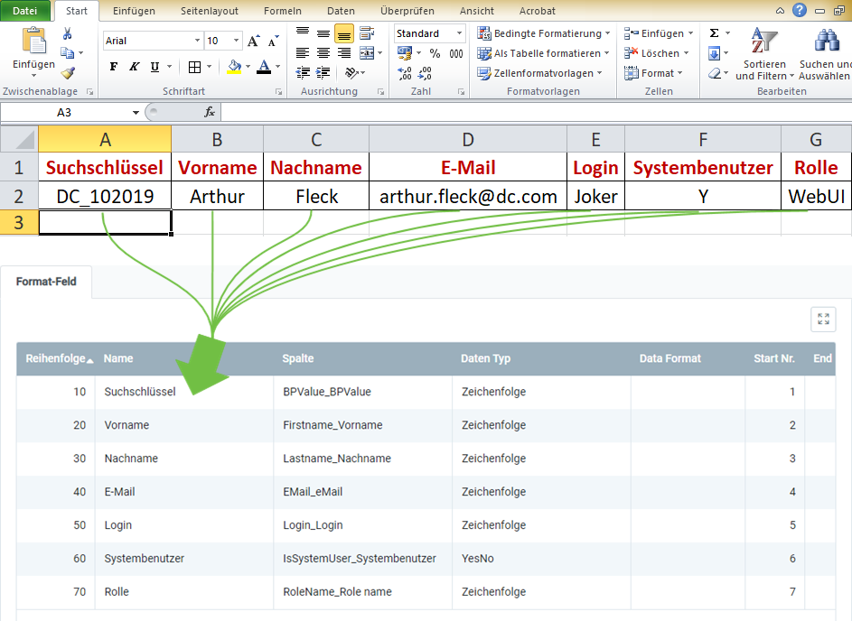

## Überblick
Für den Nutzerdatenimport benötigst Du ein Importformat, in dem die **DB-Tabelle** *Import User* eingestellt ist.

In dem folgenden Beispiel wird der Dateninhalt aus einer Datei einer Tabellenkalkulationssoftware (hier z.B. eine *Excel*-Datei vor der [Konvertierung in eine CSV- oder TXT-Datei](Importdatei_nuetzliche_Hinweise)) dem Importformat für Nutzerdaten gegenübergestellt:

### Erläuterungen zum Beispiel
- Die **Spalte A** der Excel-Tabelle (*Suchschlüssel*) steht an erster Stelle, d.h. das entsprechende Formatfeld bekommt die **Start-Nr. 1**. Demzufolge erhält das Formatfeld für die **Spalte B** die **Start-Nr. 2** usw.  Die **Reihenfolge** der Formatfelder ist dabei unerheblich.
 >**Hinweis:** metasfresh erwartet ***keine Spaltennamen*** in der Importdatei. Alleine die ***Position*** der Spalte muss mit der Startnummer übereinstimmmen.

- Der **Name** des Formatfeldes ist frei wählbar und muss nicht mit der Benennung der Spalte aus der Importdatei übereinstimmen.
- Die **Spalte** des Formatfeldes bestimmt, wohin metasfresh den Inhalt der Spalte aus der Importdatei übertragen soll.
- Der **Datentyp** bestimmt, ob es sich bei den Importdaten z.B. um eine *Zeichenfolge* oder *Zahl* handelt.

### Einige nützliche Hinweise
Die Angabe der Pflichtfelder ist unerlässlich für einen erfolgreichen Datenimport!

| Pflichtfeld | <abbr title="Bewege den Mauszeiger über den Feldnamen, um den entspr. Spaltennamen zu sehen.">Feldname</abbr> | Beispiel | Hinweis |
| :---: | :---: | :--- | :--- |
| X | <abbr title="BPValue_BPValue">Suchschlüssel</abbr> | DC_102019 | Suchschlüssel des mit dem Nutzer verknüpften Geschäftspartners (eindeutige alphanumerische Zeichenfolge) |
| X | <abbr title="Firstname_Vorname">Vorname</abbr> | Arthur | Vorname des Nutzers |
| X | <abbr title="Lastname_Nachname">Nachname</abbr> | Fleck | Nachname des Nutzers |
|  | <abbr title="EMail_eMail">E-Mail</abbr> | arthur.fleck@dc.com | E-Mail-Adresse des Nutzers |
|  | <abbr title="Login_Login">Login</abbr> | Joker | Login des Nutzers |
|  | <abbr title="IsSystemUser_Systembenutzer">Systembenutzer</abbr> | •&nbsp;Y / true = Ja  •&nbsp;N / false = Nein | Zeigt an, ob es sich um einen [Systembenutzer](Neuer_Systembenutzer) mit Anmeldeberechtigung handelt. |
|  | <abbr title="RoleName_Role name">Rolle</abbr> | WebUI | Die [Benutzerrolle](NeueBenutzerrolle) legt die Zugriffsberechtigungen eines Nutzers auf Funktionen und Daten fest. |

## Nächste Schritte
- [Nutzerdaten importieren](Nutzerdaten_importieren).
