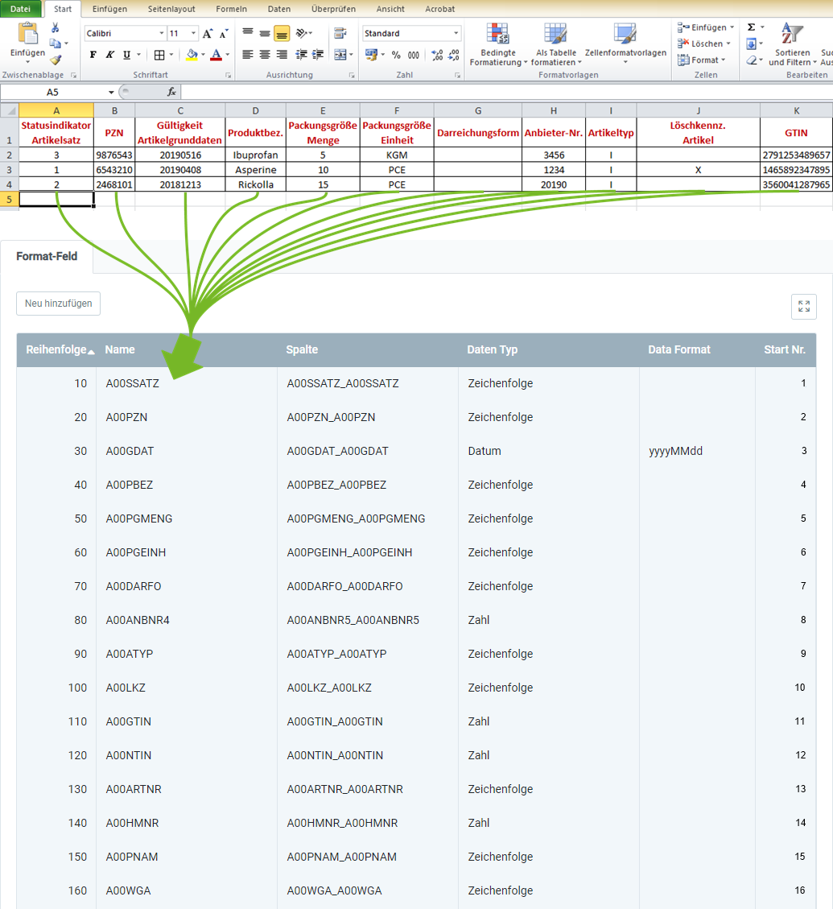

## Überblick
Für den Import von Produktdaten gemäß <a href="https://www.ifaffm.de/de/ifa-gmbh.html" alt="Informationsstelle für Arzneispezialitäten" target="blank">IFA GmbH</a> benötigst Du ein Importformat, in dem die **DB-Tabelle** *Import Pharma Product* eingestellt ist.

In dem folgenden Beispiel wird der Dateninhalt aus einer Datei einer Tabellenkalkulationssoftware (hier z.B. eine *Excel*-Datei vor der [Konvertierung in eine CSV- oder TXT-Datei](Importdatei_nuetzliche_Hinweise)) dem Importformat für IFA-Produktdaten gegenübergestellt:

### Erläuterungen zum Beispiel
- Die **Spalte A** der Excel-Tabelle (*Statusindikator Artikelsatz*) steht an erster Stelle, d.h. das entsprechende Formatfeld bekommt die **Start-Nr. 1**. Demzufolge erhält das Formatfeld für die **Spalte B** die **Start-Nr. 2** usw.  Die **Reihenfolge** der Formatfelder ist dabei unerheblich.
 >**Hinweis:** metasfresh erwartet ***keine Spaltennamen*** in der Importdatei. Alleine die ***Position*** der Spalte muss mit der Startnummer übereinstimmmen.

- Der **Name** des Formatfeldes ist frei wählbar und muss nicht mit der Benennung der Spalte aus der Importdatei übereinstimmen.
- Die **Spalte** des Formatfeldes bestimmt, wohin metasfresh den Inhalt der Spalte aus der Importdatei übertragen soll.
- Der **Datentyp** bestimmt, ob es sich bei den Importdaten z.B. um eine *Zeichenfolge* oder *Zahl* handelt.

### Einige nützliche Hinweise
Die Angabe der Pflichtfelder ist unerlässlich für einen erfolgreichen Datenimport!
 >**Hinweis:** Ausführliche Informationen zu den Feldbedeutungen gibt es in der Produktbeschreibung der IFA-Informationsdienste (<a href="https://www.ifaffm.de/mandanten/1/documents/03_ifa_fuer_datenbezieher/Produktbeschreibung_10218-20218_lang.pdf" alt="IFA-Informationsdienste Produktbeschreibung" target="blank">PDF hier herunterladen und lesen</a>).

| Pflichtfeld | Feldname | Hinweis |
| :---: | :---: | :--- |
|  | A00SSATZ | Statusindikator Artikelsatz  (0=Bestand, 1=neu, 2=Wegfall, 3=Änderung) |
| X | A00PZN | Pharmazentralnummer (Ident-Nr., die den Artikel im IFA-Artikelinfodienst identifiziert) |
|  | A00GDAT | Gültigkeit Artikelgrunddaten |
|  | A00PBEZ | Produktbezeichnung |
|  | A00PGMENG | Die Mengenangabe zur Verbrauchereinheit, die durch die PZN identifiziert wird (Packungsgröße Menge). |
|  | A00PGEINH | Die Maßeinheit der Mengenangabe zur Verbrauchereinheit (Packungsgröße Einheit). |
|  | A00DARFO | Darreichungsform |
|  | A00ANBNR4 | Anbieter-Nr. (Ident-Nr., die den **Anbieter** des Artikels identifiziert) |
|  | A00ATYP | Kennzeichen Artikeltyp |
|  | A00LKZ | Löschkennzeichen Artikel |
|  | A00GTIN | Global Trade Item Number (GTIN) / Universal Product Code (UPC) |
|  | A00NTIN | National Trade Item Number |
|  | A00ARTNR | Artikelnummer des Anbieters |
|  | A00HMNR | Hilfsmittelpositionsnummer |
|  | A00PNAM | Produktname (Handelsname bzw. die Bezeichnung des Artikels) |
| (X) | A00WGA | Kennzeichen Warengruppe A (**Produktkategorie**). Die Angabe ist nur bei IFA-Produkten erforderlich, die ***neu*** nach metasfresh importiert werden (Statusindikator 1=neu). |
|  | A00PPN | Pharmacy Product Number (Die Produktnummer ist eine weltweit eindeutige Nummer, die aus der PZN erzeugt wird.) |
|  | A05GDAT | Gültigkeit Lagerungsinfos |
|  | A05VFDAT | Kennzeichen Verfalldatum |
|  | A05LZEIT | Laufzeit (Die garantierte Haltbarkeitsdauer des Artikels in Monaten, gerechnet ab dem Herstellungszeitpunkt.) |
|  | A05KKETTE | Kennzeichen Kühlkette (Kennzeichen für temperaturempfindliche Artikel, die bei Lagerung und Transport gekühlt werden müssen.) |
|  | A05TMAX | Maximale Lagerungstemperatur in Grad Celsius |
|  | A05TMIN | Minimale Lagerungstemperatur in Grad Celsius |
|  | A05LICHT | Kennzeichen lichtempfindlich (Kennzeichen für Artikel, die unter besonderer Berücksichtigung der Lichtverhältnisse gelagert werden müssen.) |
|  | A05FEUCHT | Kennzeichen feuchteempfindlich (Kennzeichen für Artikel, die unter besonderer Berücksichtigung der Luftfeuchtigkeit gelagert werden müssen.) |
|  | A05LAGE | Kennzeichen lageempfindlich (Kennzeichen für Artikel, die unter besonderer Berücksichtigung der Lage gelagert werden müssen.) |
|  | A05ZERBR | Kennzeichen zerbrechlich (Kennzeichen für besonders zerbrechliche Artikel.) |
|  | A05EICH | Kennzeichen Eichung (Kennzeichen für Artikel, die der Eichpflicht gemäß § 37 MessEG unterliegen.) |
|  | A05LZEICH | Laufzeit Eichung (Gültigkeitsdauer der Eichung in Monaten.) |
|  | A04GDAT | Gültigkeit Packungsinfos |
|  | A04LAENGE | Länge der Verbrauchereinheit in Millimeter (keine Dezimalstellen) |
|  | A04HOEHE | Höhe der Verbrauchereinheit in Millimeter (keine Dezimalstellen) |
|  | A04BREITE | Breite der Verbrauchereinheit in Millimeter (keine Dezimalstellen) |
|  | A04GWCHT | Bruttogewicht der Verbrauchereinheit in Gramm (keine Dezimalstellen) |
|  | A04VPART | Kennzeichen Verpackungsart (Packmitteltyp gemäß DIN 55 405 Teil 3) |
|  | A04MBEST | Mindestbestellmenge |
|  | A01GDAT | Gültigkeit Preisinfos |
|  | A01SKAEP | Statusindikator des Krankenhauseinkaufspreises (KAEP) in EURO |
|  | A01SAPU | Statusindikator des Abgabepreises des pharmazeutischen Unternehmers (APU) in EURO |
|  | A01SAEP | Statusindikator des Apothekeneinkaufspreises (AEP) in EURO |
|  | A01SAVP | Statusindikator des Apothekenverkaufspreises (AVP) in EURO |
|  | A01SUVP | Statusindikator der Unverbindlichen Preisempfehlung (UVP) in EURO |
|  | A01SZBV | Statusindikator zur besonderen Verwendung (ZBV) |
|  | A01SAB130A | Statusindikator Abschlag nach § 130a Absatz 2 SGB V |
|  | A01KAEP | Krankenhauseinkaufspreis ohne MwSt in EURO, dargestellt als Cent-Betrag. |
|  | A01APU | Abgabepreises des pharmazeutischen Unternehmers |
|  | A01AMPVSGB | Information zur Anwendungspflicht der AMPreisV SGB V |
|  | A01AMPVAMG | Information zur Anwendungspflicht der AMPreisV AMG |
|  | A01AEP | Apothekeneinkaufspreis ohne MwSt in EURO, dargestellt als Cent-Betrag. |
|  | A01AVP | Apothekenverkaufspreis inkl. MwSt in EURO, dargestellt als Cent-Betrag. |
|  | A01UVP | Unverbindliche Preisempfehlung inkl. MwSt in EURO, dargestellt als Cent-Betrag |
|  | A01ZBV | Datenfeld zur besonderen Verwendung (ZBV) |
|  | A01MWST | Der Steuersatz gemäß § 12 UStG für den Artikel. |
|  | A01PPU | Preis des pharmazeutischen Unternehmers (PPU) in EURO, dargestellt als Cent-Betrag. |
|  | A01AB130A2 | Abschlag nach § 130a Absatz 2 SGB V in EURO, dargestellt als Cent-Betrag. |
|  | A01APU783A | Abgabepreis des pharmazeutischen Unternehmers gemäß § 78 Absatz 3a Satz 1 AMG in EURO, dargestellt als Cent-Betrag. |
|  | A01AEPPPU | Angabe des Apothekeneinkaufspreises des pharmazeutischen Unternehmers in EURO, dargestellt als Cent-Betrag. |
|  | A01AVPPPU | Angabe des Apothekenverkaufspreises des pharmazeutischen Unternehmers in EURO, dargestellt als Cent-Betrag. |
|  | A01DPPUAPU | Differenz zwischen dem PPU und dem APU gemäß § 78 Absatz 3a Satz 1 AMG in EURO, dargestellt als Cent-Betrag. |
|  | A01RESERV1 | Reservefeld 1 (Information in EURO, dargestellt als Cent-Betrag) |
|  | A01RESERV2 | Reservefeld 2 (Information in EURO, dargestellt als Cent-Betrag) |
|  | A01RESERV3 | Reservefeld 3 (Information in EURO, dargestellt als Cent-Betrag) |
|  | A02GDAT | Gültigkeit Rechtsinfos |
|  | A02AM | Kennzeichen Arzneimittel |
|  | A02MP | Kennzeichen Medizinprodukt |
|  | A02MP31 | Kennzeichen Medizinprodukt gemäß § 31 Absatz 1 Satz 2 SGB V |
|  | A02MPKLASS | Kennzeichen Medizinprodukte-Klasse |
|  | A02INVITRO | Kennzeichen In-vitro-Diagnostika-Klasse |
|  | A02APPFL | Kennzeichen apothekenpflichtig |
|  | A02VSPFL | Kennzeichen verschreibungspflichtig |
|  | A02BTM | Kennzeichen für Betäubungsmittel (BTM) |
|  | A02BOPST | Nummer der Bundesopiumstelle (BOPST) für den Außenhandel mit Betäubungsmitteln (8-stelliges nummerisches Kennzeichen) |
|  | A02TFG | Kennzeichen TFG (Information über die Anwendbarkeit des Begriffs 'Blutprodukt' gemäß § 2 Nr.3 TFG auf den Artikel.) |
|  | A02DROCH | Kennzeichen Droge / Chemikalie |
|  | A02TIERAM | Kennzeichen Tierarzneimittel |
|  | A02NEGLIS | Kennzeichen Negativliste |
|  | A02HMZV | Kennzeichen Hilfsmittel zum Verbrauch |
|  | A02LIFSTYL | Kennzeichen Life-Style |
|  | A02HOMOEO | Kennzeichen Homöopathikum |
|  | A02ANTHRO | Kennzeichen Anthroposophikum |
|  | A02PHYTO | Kennzeichen Phytopharmakon |
|  | A02AUSNREI | Kennzeichen Ausnahmeregelung nach § 51 AMG |
|  | A02GENER | Kennzeichen bezugnehmende Zulassung als Generikum |
|  | A02SDB | Kennzeichen Sicherheitsdatenblatt für Gefahrstoffe erforderlich |
|  | A02UNNR | Die UN-Nr. (Stoffnummer) beschreibt das Gut, von dem ein Gefährdungspotential ausgeht (z.B.: 1203 Benzin). |
|  | A02ZULREG | Zulassungs- oder Registrierungsnummer (30-stelliges alphanumerisches Feld) |
|  | A02LEBENSM | Kennzeichen Lebensmittel im Sinne von Nahrungsergänzungsmitteln (NEM) oder Diätetika |
|  | A02NEM | Kennzeichen Nahrungsergänzungsmittel nach § 1 NemV |
|  | A02DIAET | Kennzeichen Diätetikum gemäß § 31 SGB V |
|  | A02BIOZID | Kennzeichen Biozid |
|  | A02PSM | Kennzeichen Pflanzenschutzmittel |
|  | A02TREZEP | Kennzeichen T-Rezept Arzneimittel |
|  | A0247AMG | Kennzeichen § 47 (1c) AMG |
|  | A02130A18 | Kennzeichen Ablösung des Abschlags nach § 130a 1 / 8 SGB V |
|  | A02130A1A8 | Kennzeichen Ablösung des Abschlags nach § 130a 1a / 8 SGB V |
|  | A0252B | Kennzeichen Ausnahme nach § 52b Absatz 2 Satz 3 AMG |
|  | A02BIOSIEG | Kennzeichen "EU-Bio-Siegel" nach ÖkoBasisVO |
|  | A02KOSMET | Kennzeichen Kosmetikum im Sinne der EG-Kosmetik-Verordnung Nr. 1223/2009 |
|  | A02STERIL | Kennzeichen steril (Information zur Sterilität eines Artikels) |
|  | A02EB130B | Kennzeichen Arzneimittel mit Erstattungsbetrag nach § 130b SGB V |
|  | A02VERB31 | Kennzeichen zu Verbandmittel gemäß § 31 Absatz 1a SGB V |
|  | A02WIRKSTO | Kennzeichen Wirkstoff |
|  | A02ELEKTRO | Kennzeichen Elektro- und Elektronikgeräte-Stoff-Verordnung (ElektroStoffV) |
|  | A02EXPLOS | Kennzeichen Explosivgrundstoff |
|  | A02BIOTECH | Kennzeichen biotechnologisch hergestelltes Arzneimittel |
|  | A02ELEKEAR | Kennzeichen Elektro- und Elektronikgerätegesetz |
|  | A02WEEEREG | WEEE-Reg.-Nr. DE |
|  | A02BATTG | Kennzeichen Batteriegesetz / Umweltbundesamt |
|  | A02MELDENR | Melderegisternummer des Umweltbundesamtes |
|  | A02CMR | Kennzeichen cmr-Gefahrstoff |
|  | A02RESERV1 | Kennzeichen Reservefeld 1 |
|  | A02RESERV2 | Kennzeichen Reservefeld 2 |
|  | A02RESERV3 | Kennzeichen Reservefeld 3 |
|  | A11GDAT | Gültigkeit Verifizierungsinformationen |
|  | A11VERIFIZ | Kennzeichen securPharm Pilot |
|  | A11VERIPFL | Verifizierung im Pflichtbetrieb ab Verfalldatum |
|  | A11VERIHOC | Verifizierung im Pflichtbetrieb ab Hochladedatum |
|  | A03GDAT | Gültigkeit Vertriebsinfos |
|  | A03VTSTAT | Kennzeichen Vertriebsstatus |
|  | A03VWGGH | Kennzeichen Vertriebsweg Großhandel |
|  | A03VWGAPO | Kennzeichen Vertriebsweg Apotheke |
|  | A03VWGKAP | Kennzeichen Vertriebsweg Krankenhausapotheke |
|  | A03VEGSEH | Kennzeichen Vertriebsweg Sonstiger Einzelhandel |
|  | A03VKSTAT | Kennzeichen Verkehrsfähigkeitsstatus |
|  | A06GDAT | Gültigkeit Verweise |
|  | A06PZNNF | PZN Nachfolger |
|  | A06PZNORIG | PZN des Originals (ist bei Import-Arzneimitteln anzugeben.) |
|  | A09GDAT | Gültigkeit Packungsgrößen |
|  | A09THGP | Kennzeichen Packungsgrößen |

## Nächste Schritte
- [IFA-Produktdaten importieren](Produktdaten_importieren_Pharma).
