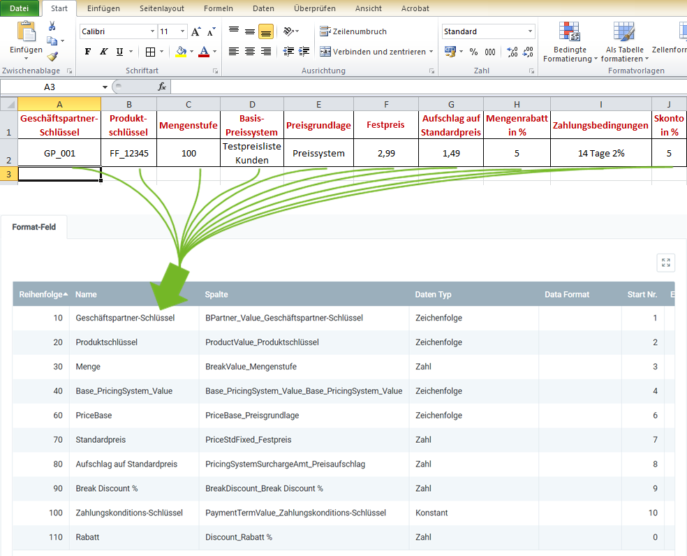

## Überblick
Für den Import von Rabattschemata benötigst Du ein Importformat, in dem die **DB-Tabelle** *I_DiscountSchema* eingestellt ist.

In dem folgenden Beispiel wird der Dateninhalt aus einer Datei einer Tabellenkalkulationssoftware (hier z.B. eine *Excel*-Datei vor der [Konvertierung in eine CSV- oder TXT-Datei](Importdatei_nuetzliche_Hinweise)) dem Importformat für Rabattschemata gegenübergestellt:

### Erläuterungen zum Beispiel
- Die **Spalte A** der Excel-Tabelle (*Geschäftspartner-Schlüssel*) steht an erster Stelle, d.h. das entsprechende Formatfeld bekommt die **Start-Nr. 1**. Demzufolge erhält das Formatfeld für die **Spalte B** die **Start-Nr. 2** usw.  Die **Reihenfolge** der Formatfelder ist dabei unerheblich.
 >**Hinweis:** metasfresh erwartet ***keine Spaltennamen*** in der Importdatei. Alleine die ***Position*** der Spalte muss mit der Startnummer übereinstimmmen.

- Der **Name** des Formatfeldes ist frei wählbar und muss nicht mit der Benennung der Spalte aus der Importdatei übereinstimmen.
- Die **Spalte** des Formatfeldes bestimmt, wohin metasfresh den Inhalt der Spalte aus der Importdatei übertragen soll.
- Der **Datentyp** bestimmt, ob es sich bei den Importdaten z.B. um eine *Zeichenfolge* oder *Zahl* handelt.

### Einige nützliche Hinweise
Die Angabe der Pflichtfelder ist unerlässlich für einen erfolgreichen Datenimport!

| Pflichtfeld | Feldname | Beispiel | Hinweis |
| :---: | :---: | :--- | :--- |
| X | Geschäftspartner-Schlüssel | GP_001 | Geschäftspartnernummer (eindeutige alphanumerische Zeichenfolge) |
| X | Produktschlüssel | FF_12345 | **Suchschlüssel** des Produktes (alphanumerische Zeichenfolge) |
| | Menge | 100 | **Mengenstufe** des Produktes, ab der eine Preiskondition gilt. |
| | Base_PricingSystem_Value | Testpreisliste Kunden | **Suchschlüssel** des Preissystems, das als Grundlage für die Preisbestimmung dient. |
| | PriceBase | • Preissystem  • Festpreis | **Preisgrundlage** kann entweder das Preissystem sein oder ein abweichend bestimmter Festpreis.  |
| | Standardpreis | 2,99 | **Festpreis**. Die Angabe ist nur erforderlich, sofern *Festpreis* als **Preisgrundlage** angegeben ist. |
| | Aufschlag auf Standardpreis | 1,49 | Preisaufschlag. Die Angabe ist nur erforderlich, sofern *Preissystem* als **Preisgrundlage** angegeben ist. |
| | Break Discount % | 5 | **Mengenrabatt** in Prozent |
| | Zahlungskonditions-Schlüssel | 14 Tage 2% | **Zahlungsziel** |
| | Rabatt | 5 | **Skonto** bei Zahlung innerhalb der Frist. |

## Nächste Schritte
- [Rabattschema importieren](Rabattschema_importieren).
