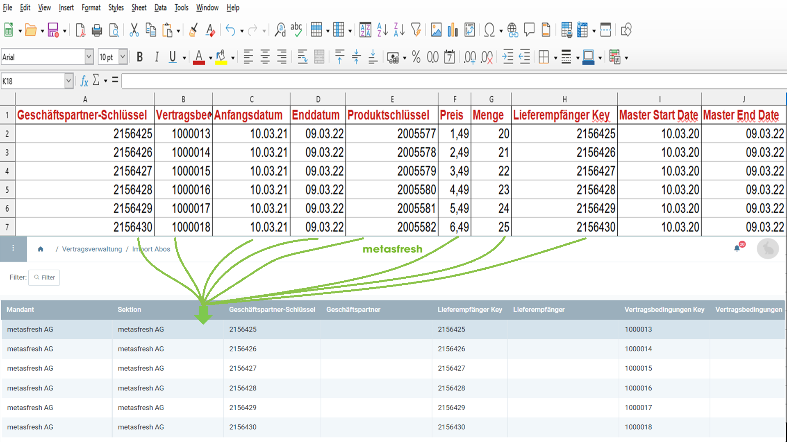

## Überblick
Für den Vertragsdatenimport benötigst du ein Importformat, in dem die **DB-Tabelle** *Contract Import* eingestellt ist.

In dem folgenden Beispiel wird der Dateninhalt einer Datei einer Tabellenkalkulationssoftware (hier z.B. eine *Excel*-Datei vor der [Konvertierung in eine CSV- oder TXT-Datei](Importdatei_nuetzliche_Hinweise)) dem Importformat für Vertragsdaten gegenübergestellt:

### Erläuterungen zum Beispiel
Die **Spalte A** der Execel-Tabelle (*Geschäftspartner-Schlüssel*) steht an erster Stelle, d.h das entsprechende Formatfeld bekommt die **Start-Nr. 1**.Demzufolge erhält das Formatfeld für die **Spalte B** die **Start-Nr. 2** usw.  Die **Reihenfolge** der Formatfelder ist dabei unerheblich.
 >**Hinweis:** metasfresh erwartet ***keine Spaltennamen*** in der Importdatei. Alleine die ***Position*** der Spalte muss mit der Startnummer übereinstimmmen.

 - Der **Name** des Formatfeldes ist frei wählbar und muss nicht mit der Benennung der Spalte aus der Importdatei übereinstimmen.
 - Die **Spalte** des Formatfeldes bestimmt, wohin metasfresh den Inhalt der Spalte aus der Importdatei übertragen soll.
 - Der **Datentyp** bestimmt, ob es sich bei den Importdaten z.B. um eine *Zeichenfolge* oder *Zahl* handelt.

### Einige nützliche Hinweise
Die Angabe der Pflichtfelder ist unerlässlich für einen erfolgreichen Datenimport!

| Pflichtfeld | <abbr title="Bewege den Mauszeiger über den Feldnamen, um den entspr. Spaltennamen zu sehen.">Feldname</abbr> | Beispiel | Hinweis |
| :---: | :---: | :--- | :--- |
| X | <abbr title="Geschäftspartner-Schlüssel">BPartnerValue_Geschäftspartner-Schlüssel</abbr> | 2156425 | Die Geschäftspartnerschlüssel legt fest, welcher Geschäftspartner dieses Abonnement abschließt |
| X | <abbr title="Vertragsbedingungen-Schlüssel">C_Flatrate_Conditions_Value_Vertragsbedingungen-Schlüssel</abbr> | 1000013 | Der Vertragsbedingungen-Schlüssel legt fest, welche Vertragsbedingungen gültig sind|
| X | <abbr title="Anfangsdatum">StartDate_Anfangsdatum</abbr> | 10.03.2021 | Beginn der aktuellen Vertagsperiode |
|  | <abbr title="Enddatum">EndDate_Enddatum</abbr> | 09.03.2022 | Ende der aktuellen Vertagsperiode |
| X | <abbr title="Produkt-Schlüssel">ProductValue_Produktschlüssel</abbr> | 2005577 | Der Produktschlüssel gibt das verwendete Produkt an |
|  | <abbr title="Preis">Price_Preis</abbr> | 1,49 | Preis des gewählten Produkts |
|  | <abbr title="Menge">Qty_Menge</abbr> | 20 | Menge des gewählten Produkts |
| X | <abbr title="Lieferempfänger">DropShip_BPartner_Value_Lieferempfänger Key</abbr> | 2156425 | Der Leistungsempfängerschlüssel legt fest an wen das Abonnement geliefert wird  |
|  | <abbr title="Vertrag Startdatum">MasterStartDate_Master Start Date</abbr> | 10.03.2020 | Beginn des Vertrags |
|  | <abbr title="Vertrag Enddatum">MasterEndDate_Master End Date</abbr> | 09.03.2022 | Ende des Vertrags |

## Nächste Schritte
- [Vertragsdaten importieren](Import_von_Vertragsdaten).
