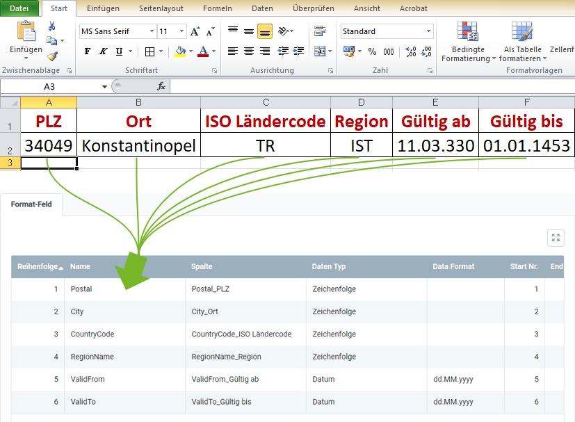

## Überblick
Für den Import postalischer Daten benötigst Du ein Importformat, in dem die **DB-Tabelle** *Import Postal Code Data* eingestellt ist.

In dem folgenden Beispiel wird der Dateninhalt aus einer Datei einer Tabellenkalkulationssoftware (hier z.B. eine *Excel*-Datei vor der [Konvertierung in eine CSV- oder TXT-Datei](Importdatei_nuetzliche_Hinweise)) dem Importformat für postalische Daten gegenübergestellt:

### Erläuterungen zum Beispiel
- Die **Spalte A** der Excel-Tabelle (*PLZ*) steht an erster Stelle, d.h. das entsprechende Formatfeld bekommt die **Start-Nr. 1**. Demzufolge erhält das Formatfeld für die **Spalte B** die **Start-Nr. 2** usw.  Die **Reihenfolge** der Formatfelder ist dabei unerheblich.
 >**Hinweis:** metasfresh erwartet ***keine Spaltennamen*** in der Importdatei. Alleine die ***Position*** der Spalte muss mit der Startnummer übereinstimmmen.

- Der **Name** des Formatfeldes ist frei wählbar und muss nicht mit der Benennung der Spalte aus der Importdatei übereinstimmen.
- Die **Spalte** des Formatfeldes bestimmt, wohin metasfresh den Inhalt der Spalte aus der Importdatei übertragen soll.
- Der **Datentyp** bestimmt, ob es sich bei den Importdaten z.B. um eine *Zeichenfolge* oder *Zahl* handelt.

### Einige nützliche Hinweise
Die Angabe der Pflichtfelder ist unerlässlich für einen erfolgreichen Datenimport!

| Pflichtfeld | Feldname | Beispiel | Hinweis |
| :---: | :---: | :--- | :--- |
|  | PLZ | 34049 | Postleitzahl |
|  | Ort | Konstantinopel | Ort bzw. Stadt |
| X | ISO-Ländercode | TR | TR = **T**ü**r**kei  Zweistelliger Buchstabencode (gem. ISO 3166-1 Alpha-2).  (*Den ISO-Ländercode kannst Du unter dem Menüpunkt "[Land, Region](Menu)" nachschauen.*) |
|  | Region | IST | IST = **Ist**anbul  (*Das Akronym bzw. den **Namen** einer Region kannst Du unter dem Menüpunkt "[Land, Region](Menu)" unter der Registerkarte "Region" des jeweiligen Ländereintrags nachschauen.*) |
|  | Gültig ab | 11.03.330 | Datum, ab dem die postalischen Daten gültig sind. |
|  | Gültig bis | 01.01.1453 | Datum, bis zu dem die postalischen Daten gültig sind. |

## Nächste Schritte
- [Postalische Daten importieren](Postalische_Daten_importieren).
