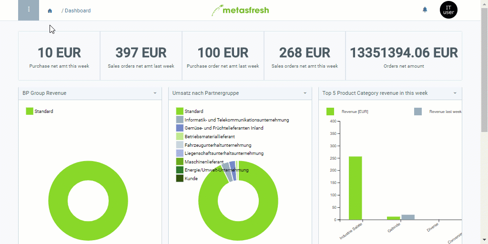

## Überblick
Mithilfe eines Importformats kannst Du festlegen, welche Daten bzw. Spalten aus einer Importdatei übernommen werden sollen, wie diese Spalten benannt und voneinander getrennt sind (Trennzeichen) und in welche Datenbanktabellen die Importdaten übertragen werden sollen.

Welche Spalten Dir beim Anlegen eines Importformats zur Auswahl stehen, ist abhängig von der **DB-Tabelle**, die mit dem Format verknüpft ist. Als Systemadministrator kannst Du diese Datenbanktabelle anpassen, verändern und erweitern, um so dem [Importformat eigene Felder hinzuzufügen](Importformat_erweitern_eigene_Felder).

Folgende Daten können nach metasfresh importiert werden:
- [Bankauszugsdaten](Bankauszugsdaten_importieren)
- [Benutzerdefinierte Dateneingaben](Dateneingaben_importieren)
- [Geschäftspartnerdaten](GPartnerdaten_importieren)
- [IFA-Herstellerdaten](GPartnerdaten_importieren_Pharma)
- [IFA-Produktdaten](Produktdaten_importieren_Pharma)
- [Kontenrahmendaten](Kontenrahmendaten_importieren)
- [Nachbestelldaten](Nachbestelldaten_importieren)
- [Nutzerdaten](Nutzerdaten_importieren)
- [Postalische Daten](Postalische_Daten_importieren)
- [Produktdaten](Produktdaten_importieren)
- [Rabattschemadaten](Rabattschema_importieren)

## Schritte

### Importformat anlegen
1. [Gehe ins Menü](Menu) und öffne das Fenster "Import Formate".
1. [Lege ein neues Importformat an](Neuer_Datensatz_Fenster_Webui).
1. Benenne das Importformat im Feld **Name**.
1. Wähle die entsprechende **DB-Tabelle** aus, in die die Daten importiert werden sollen, z.B. für Geschäftspartner *Import - Geschäftspartner*, für Produkte *Import - Produkt* usw. ([siehe Übersichtstabelle hier](Datenimport_nach_metasfresh))
1. Wähle ein **Format** (Trennzeichen) aus, z.B. *Tabulator-separiert*.
 >**Hinweis:** Für einen erfolgreichen Datenimport muss das Trennzeichen der Importdatei mit dem aus dem Importformat übereinstimmen (Komma, Tabulatorzeichen, Semikolon usw.).

1. ***Optional:*** Setze ein Häkchen bei **IsManualImport**, wenn Du die Daten manuell importieren möchtest. Ansonsten werden Sie automatisch verarbeitet, sofern keine Fehler auftreten.

### a) Formatfelder hinzufügen
1. Gehe zur Registerkarte "Format-Feld" unten auf der Seite und klicke auf . Es öffnet sich ein Overlay-Fenster.
1. Benenne das Formatfeld im Feld **Name**, z.B. "Suchschlüssel".
1. Wähle eine **Spalte** aus, in die der Inhalt der Importdatei später übertragen werden soll, z.B. *Value_Suchschlüssel*.
1. Wähle einen **Datentyp** aus, z.B. *Zeichenfolge* oder *Zahl*, je nach Art der Importdaten.
1. Lege im Feld **Data Format** ein geeignetes Datenformat fest, sofern notwendig (z.B. beim Datentyp *Datum* das Format *dd.MM.yyyy*).
 >**Hinweis:** Weitere Informationen über Datumsformate findest Du <a href="https://docs.oracle.com/javase/7/docs/api/java/text/SimpleDateFormat.html" title="Formatbeispiele für Daten | Oracle.com" target="\_blank">hier</a>.

1. Vergib eine **Start-Nr.**
 >**Hinweis:** Die **Startnummer** bestimmt die Position, an der in der Importdatei eine Spalte von metasfresh beim Import erwartet wird, und hat nichts mit der **Reihenfolge**, in der die Formatfelder zum Importformat hinzugefügt wurden, zu tun. Es ist daher nicht nötig, dass die Felder in einer festen und aufsteigenden Reihenfolge sind, solange die Startnummern mit den Spaltenpositionen in der Importdatei übereinstimmen.

1. Klicke auf "Bestätigen", um das Overlay-Fenster zu schließen und das Formatfeld zur Liste hinzuzufügen.
 >**Hinweis:** Wiederhole die Schritte 1 bis 6, um weitere Formatfelder hinzuzufügen.

### b) Formatfelder übertragen
Möchtest Du ein neues Importformat anlegen mit den gleichen Formatfeldern wie ein bestehendes Format, dann kannst Du die Formatfelder ganz einfach über das [Aktionsmenü](AktionStarten#aktionsmenue) aus dem bestehenden in das neue Importformat übertragen. Gehe hierzu wir folgt vor:

1. Lege ein neues Importformat an, wie oben in den **Schritten 1 bis 5** beschrieben.
1. [Starte die Aktion](AktionStarten#aktionsmenue) "Positionen kopieren". Es öffnet sich ein Overlay-Fenster.
1. Wähle das entsprechende **Importformat** aus, aus dem Du die Formatfelder übertragen möchtest.
 >**Hinweis:** Um die Formatfelder aus einem bestehenden Importformat erfolgreich zu übertragen, muss in dem neuen Format **_dieselbe_ DB-Tabelle** eingestellt sein wie in dem bestehenden.

1. Klicke auf "Start", um die Formatfelder zu übertragen und das Overlay-Fenster zu schließen.

## Nächste Schritte
- [Bankauszugsdaten importieren](Bankauszugsdaten_importieren).
- [Benutzerdefinierte Dateneingaben importieren](Dateneingaben_importieren).
- [Geschäftspartnerdaten importieren](GPartnerdaten_importieren).
- [IFA-Herstellerdaten importieren](GPartnerdaten_importieren_Pharma).
- [IFA-Produktdaten importieren](Produktdaten_importieren_Pharma).
- [Kontenrahmendaten importieren](Kontenrahmendaten_importieren).
- [Nachbestelldaten importieren](Nachbestelldaten_importieren).
- [Nutzerdaten importieren](Nutzerdaten_importieren).
- [Postalische Daten importieren](Postalische_Daten_importieren).
- [Produktdaten importieren](Produktdaten_importieren).
- [Rabattschemadaten importieren](Rabattschema_importieren).

## Beispiel

