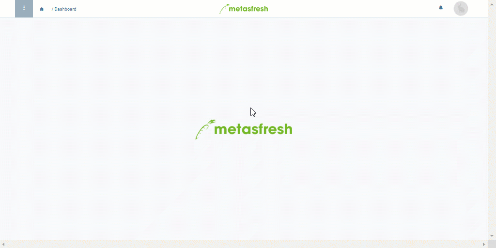

## Übersicht
Manche Produkte, die Du im Lagerbestand führst, sind für den Eigenverbrauch bestimmt und stehen somit für den Handel mit anderen Geschäftspartnern nicht mehr zur Verfügung. Dies bedeutet, dass sie aus dem Bestand entfernt bzw. entsorgt werden müssen. In einer Warenbestandsaufnahme für den internen Verbrauch werden die entsorgten Produkte dann übersichtlich aufgelistet, um stets nachverfolgen zu können, was mit den Produkten geschehen ist.

## Schritte
1. [Gehe ins Menü](Menu) und öffne das Fenster "Handling Unit Editor".
1. [Selektiere](AuswahlBelege) aus der Liste eine oder mehrere [Handling Units](Handling_Unit_System), die Du als Eigenverbrauch verbuchen möchtest.
1. [Starte die Quick-Action](AktionStarten) "Mass Disposal". Es öffnet sich ein Overlay-Fenster.
 >**Hinweis:** Diese Aktion findest Du ebenfalls im Aktionsmenü.

1. Gib im Feld **Kostenstelle** einen Teil des Ortes der Kostenentstehung ein und klicke auf den passenden Treffer in der [Dropdown-Liste](Keyboard_Shortcuts_Liste), z.B. *Verwaltung*.
1. ***Optional:*** Trage eine **Beschreibung** in das dafür vorgesehene Textfeld ein.
1. Klicke auf "Start", um das Overlay-Fenster zu schließen und die ausgewählten HUs als Eigenverbrauch zu verbuchen.
1. Du erhältst oben rechts eine [Benachrichtigung](Benachrichtigungsarten) , sobald der Eigenverbrauch verbucht wurde.
1. Klicke auf die Benachrichtigung, um den Eigenverbrauchseintrag zu öffnen.
1. [Öffne die PDF-Vorschau](PDFVorschau) des Inventurbelegs.

## Nächste Schritte (optional)
- [Mache den verbuchten Eigenverbrauch rückgängig](Inventur_Eigenverbrauch_stornieren).

## Beispiel

