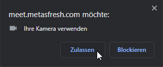
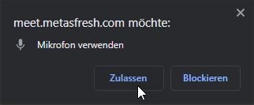
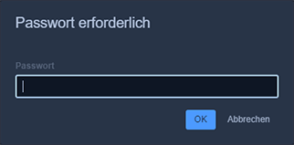
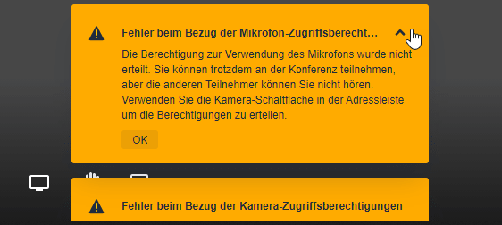
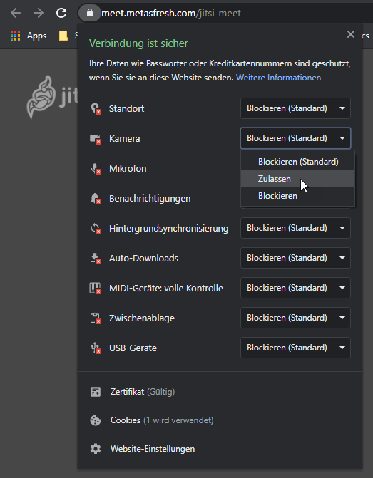
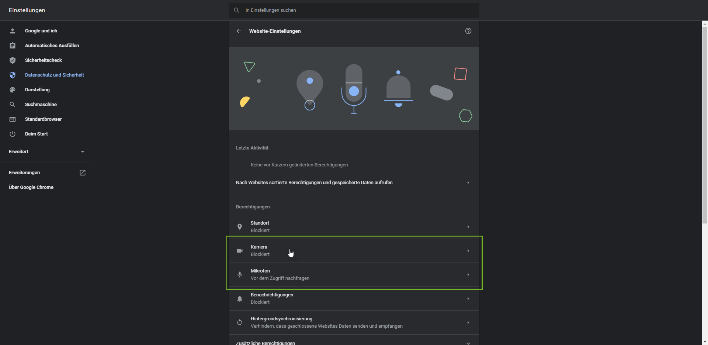
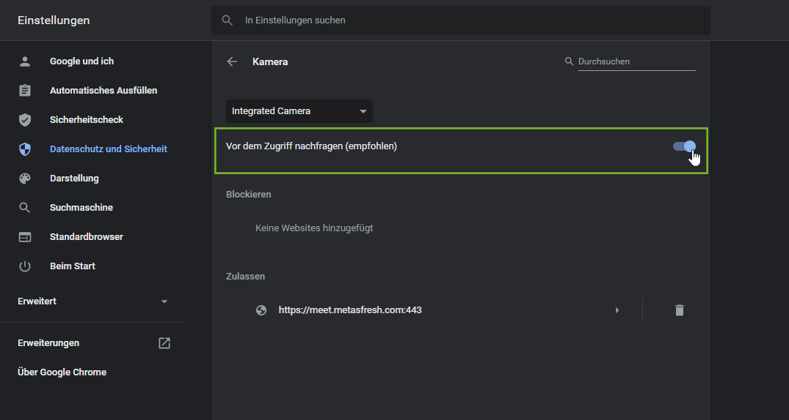
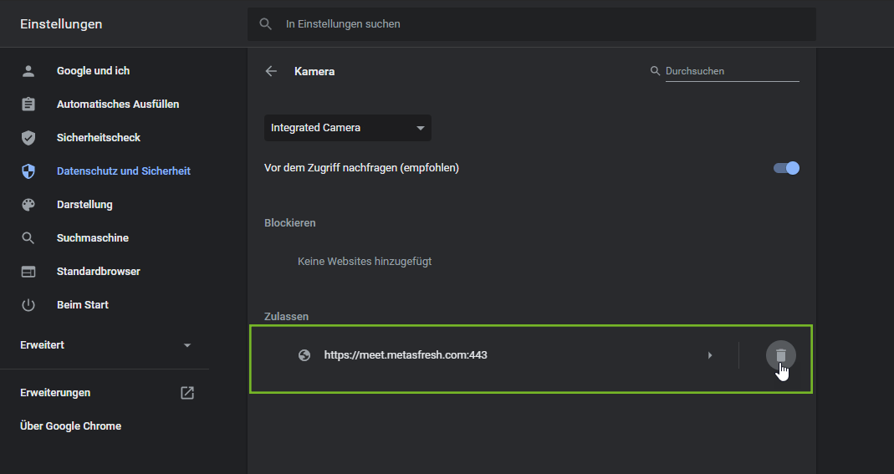

## Überblick
Für virtuelle Besprechungen und Jours fixes mit unseren Kunden nutzen wir <a href="https://github.com/jitsi/jitsi-meet#jitsi-meet---secure-simple-and-scalable-video-conferences" title="Jitsi Meet - Secure, Simple and Scalable Video Conferences | github.com" target="\_blank">Jitsi Meet</a>, eine Open-Source (Apache) WebRTC-JavaScript-Anwendung bestehend aus einer Sammlung freier Software für IP-Telefonie (VoIP), Videokonferenzen und Instant Messaging.

Um das beste Jitsi Meet-Erlebnis mit metasfresh zu erzielen, empfehlen wir, die aktuelle Version des **<a href="https://www.google.com/intl/de_de/chrome/" title="Chrome herunterladen | google.com" target="\_blank">Google Chrome-Webbrowsers</a>** zu verwenden und alle **AdBlocker zu deaktivieren**.

## Schritte

### Einem Meeting beitreten
1. Um einem Meeting beizutreten, rufen Sie den Link auf, den Sie von metasfresh erhalten haben. Der Jitsi Meet-Raum wird geöffnet.
1. Sollten Sie an dieser Stelle oben links eine Browser-Benachrichtigung darüber erhalten, dass `meet.metasfresh.com` Ihr Mikrofon und/oder Ihre Kamera verwenden möchte, dann klicken Sie auf "Zulassen".

    |  |  |
    | :---: | :---: |

1. Sofern Sie ein Passwort erhalten haben, geben Sie es bei Aufforderung im Browser ein. Anschließend befinden Sie sich im Meeting-Raum.

    <kbd></kbd>

1. Unter Umständen werden unten links auf der Jitsi Meet-Oberfläche Fehlermeldungen angezeigt wegen fehlender Zugriffsberechtigungen.

    <kbd></kbd>

    Um diese Fehler zu beheben, müssen die Browser-Einstellungen angepasst werden. Die Vorgehensweise in einem solchen Fall wird unter dem folgenden Abschnitt näher beschrieben.

## Fehler beim Bezug von Zugriffsberechtigungen beheben
Um Jitsi Meet optimal zu nutzen, benötigt Ihr Browser die entsprechenden Zugriffsberechtigungen für Kamera und Mikrofon. Diese können an unterschiedlichen Orten im Browser erteilt werden. Im Folgenden beschreiben wir die verschiedenen Optionen Schritt für Schritt. Sollten nach Befolgen der Schritte einer Option die Fehlermeldungen weiter bestehen, überprüfen Sie die Einstellungen bitte erneut anhand einer der anderen Optionen. Anschließend werden Sie möglicherweise aufgefordert, die Seite neu zu laden.

<kbd></kbd>

Oftmals kann auch ein Browser-Neustart hilfreich sein. Um ganz auf Nummer sicher zu gehen, empfehlen wir, **den Meeting-Link einfach neu aufzurufen**.

### Option 1
1. Klicken Sie links oben in der Adresszeile des Browsers auf das kleine Vorhängeschlosssymbol <kbd></kbd>, um die Berechtigungsübersicht der Website zu öffnen.
1. Dort können Sie nun die Zugriffsberechtigungen erteilen, indem Sie in der Dropdown-Liste "Zulassen" auswählen.

    <kbd></kbd>

1. Stellen Sie auf diese Weise sicher, dass die Website auf Kamera und Mikrofon zugreifen darf.

---

### Option 2
1. Klicken Sie rechts oben in der Adresszeile des Browsers auf das kleine Kamerasymbol <kbd></kbd>, um den Zugriff auf Kamera und Mikrofon zu verwalten.
1. Wählen Sie je nach Vorschlag eine der folgenden Optionen aus:
    - "`https://meet.metasfresh.com` immer Zugriff auf Ihre Kamera gestatten."
    - "`https://meet.metasfresh.com` immer Zugriff auf Ihr Mikrofon gestatten."
    - "`https://meet.metasfresh.com` immer Zugriff auf Kamera und Mikrofon gestatten."

    <kbd></kbd>

1. Klicken Sie auf "Fertig", um die Einstellung zu speichern.
    >**Hinweis:** Wenn Sie links auf "Verwalten" klicken, gelangen Sie direkt zu den Website-Einstellungen des Browsers. Mehr dazu unter **Option 3**.

1. Gegebenenfalls müssen die zuvor genannten Schritte für das jeweils andere Gerät wiederholt werden, sofern der Zugriff nur einzeln gewährt wurde.

---

### Option 3
1. <a href="https://support.google.com/chrome/answer/114662?co=GENIE.Platform%3DDesktop&hl=de" title="Websiteberechtigungen ändern | support.google.com" target="\_blank">Öffnen Sie die Website-Einstellungen Ihres Chrome-Browsers</a>.
1. Hier können Sie die Berechtigungen u.a. für Kamera und Mikrofon ebenfalls überprüfen und verwalten.

    <kbd></kbd>

1. Klicken Sie in der Berechtigungsübersicht auf den Eintrag des jeweiligen Gerätes, um dessen Einstellungen zu verwalten.
1. Stellen Sie den Schalter oben rechts von "Blockiert" auf "Vor dem Zugriff nachfragen (empfohlen)".

    <kbd></kbd>

1. Kehren Sie zurück zur Berechtigungsübersicht und wiederholen Sie die vorigen Schritte 3 und 4 für das jeweils andere Gerät.
1. Unter den jeweiligen Einträgen können Sie außerdem jegliche zugelassene Websites wieder entfernen und so eventuell erteilte Zugriffsberechtigungen rückgängig machen. Klicken Sie hierzu einfach auf das kleine Mülleimersymbol <kbd></kbd> rechts neben der Website-URL, die Sie entfernen möchten.

    <kbd></kbd>
