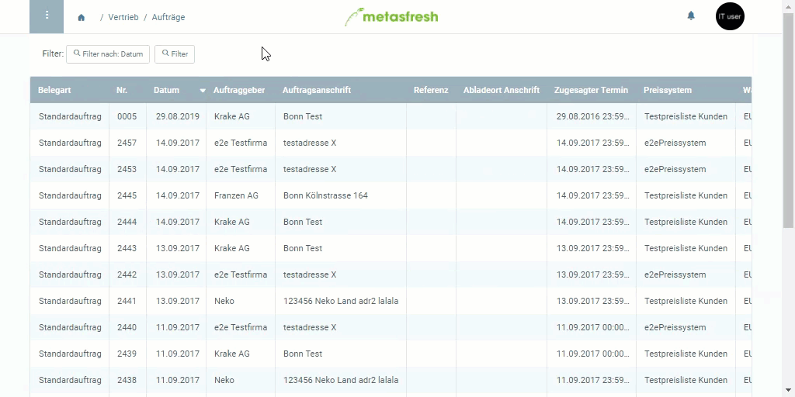

## Übersicht
Um Dir die Arbeit beim Erfassen von Dokumenten mit ähnlichen oder gleichen Daten wie in bestehenden Dokumenten zu erleichtern, kannst Du die vorhandenen Datensätze eines Fensters einschließlich aller dazugehörigen Subtabs mithilfe der *Klonen-Funktion* einfach vollständig duplizieren. 
Das Klonen funktioniert bei allen Stammdaten und Belegen wie Auftrag, Bestellung usw.

## Schritte
1. Gehe über das [Menü](Menu) zu dem Datensatz, den Du klonen möchtest (z.B. einem Auftrag), und öffne ihn.
1. [Starte die Aktion](AktionStarten) "Clone".
1. Der gesamte geklonte Datensatz wird in einem neuen Fenster geöffnet.
 >Hinweis 1: Bis auf variable Daten, wie z.B. laufende Nummern oder Suchschlüssel (Artikelnummern, Belegnummern usw.), werden alle Datensätze unverändert geklont.  
 >Hinweis 2: Fertiggestellte Dokumente, wie z.B. Aufträge, werden als Entwurf geklont, um sie ggf. bearbeiten zu können, und müssen anschließend wieder manuell fertiggestellt werden.

## Beispiel
 
