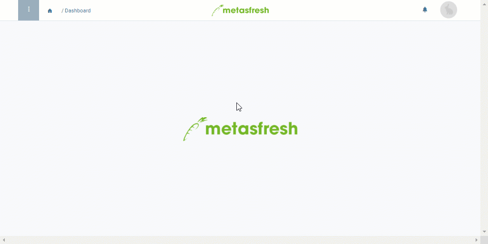

## Übersicht
Ein Kombinierungsprodukt ist ein Sonderprodukt, welches in [Aufträgen](Auftrag_erfassen) und [Angeboten](Angebot_erstellen) dazu dient, mehrere Auftragszeilen zu Kompensationsgruppen zusammenzufassen, um sie anschließend gemeinsam weiterzuverarbeiten.

Bei der [Gruppenrabattierung](Auftragszeilengruppenrabatt) zum Beispiel kommt ein [*Rabattprodukt*](Kompensationsgruppen_manuell_erstellen) zur Anwendung, um die selektierten Auftragszeilen zu gruppieren und dann gemeinsam zu rabattieren oder aufzuschlagen.

Bei der [Erstellung von Stücklisten aufgrund eines Angebots](Stueckliste_bei_Auftragsgenerierung) dient das Kombinierungsprodukt dazu, Produktionsbestandteile zu einer Angebotsgruppe zu vereinen, auf deren Grundlage später die Stückliste und das Verkaufsprodukt erstellt werden.

Grundsätzlich wird ein Kombinierungsprodukt wie jedes andere normale [Produkt](NeuesProdukt) auch angelegt, unter Berücksichtigung der folgenden anwendungsspezifischen Konfiguration:

## Schritte
1. [Gehe ins Menü](Menu) und öffne das Fenster "Produkte".
1. [Lege ein neues Produkt an](Neuer_Datensatz_Fenster_Webui).
1. Trage in das Feld **Name** einen sinnvollen Namen ein, z.B. "Rabatt".
1. Wähle eine geeignete **Produktkategorie** aus, z.B. *Kombinierungsprodukt*.
1. Entferne das Häkchen bei **Lagerhaltig**.
1. [Füge das Produkt einer Preisliste hinzu](ProduktPreis).
1. [metasfresh speichert automatisch](Speicheranzeige).

| **Wichtig!** |
| :- |
| Das Kombinierungsprodukt darf ***nicht lagerhaltig*** sein und muss mit ***derselben Preisliste*** verknüpft sein wie der Auftrag, in dem es zum Einsatz kommen soll! |

## Beispiel

