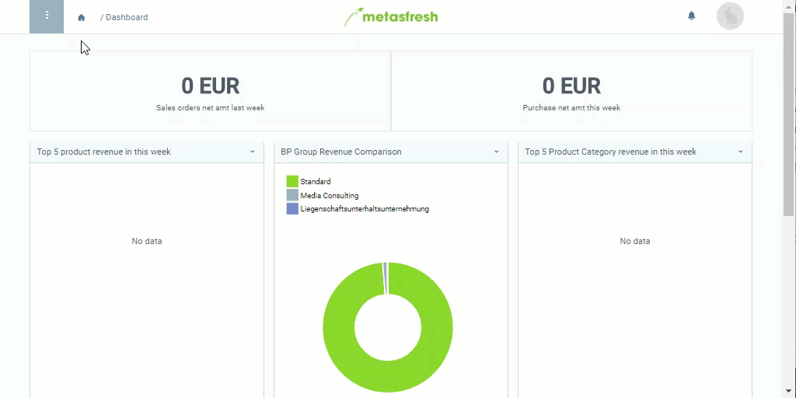

## Überblick
In metasfresh kannst Du Produkte mit ähnlichen Eigenschaften in Kategorien einordnen, um sie besser zu organisieren. Diese Produktkategorien ermöglichen es in Verbindung mit einem [Kompensationsgruppenschema](Kompensationsgruppenschema_anlegen) bei der [Gruppenrabattierung](Auftragszeilengruppenrabatt), die Produkte einer Kategorie [automatisch zu einer Kompensationsgruppe zusammenzufassen](Kompensationsgruppen_automatisch_erstellen).

Um das Kompensationsgruppenschema mit einer Produktkategorie zu verknüpfen, gehe wie folgt vor:

## Schritte
1. [Gehe ins Menü](Menu) und öffne das Fenster "Produkt Kategorie".
1. Öffne den Eintrag einer bestehenden Produktkategorie bzw. [lege eine neue an](NeueProduktkategorie).
1. Gehe zum Feld **Kompensationsgruppenschema** und wähle das gewünschte Schema aus, z.B. *Kompensationsgruppe I*.
1. [metasfresh speichert automatisch](Speicheranzeige).

## Alternative Konfiguration - Subkategorisierung
Anstatt eine Produktkategorie mit einem Kompensationsgruppenschema zu verknüpfen, kannst Du sie auch einer anderen Kategorie unterordnen, welche ihrerseits wiederum mit einem Kompensationsgruppenschema verknüpft ist. Beim [Gruppenrabattierungsprozess](Auftragszeilengruppenrabatt) wird dann das Schema der *übergeordneten Kategorie* auf die Kompensationsgruppe angewandt. So lassen sich einzelne Produkte unterschiedlich voneinander kategorisieren und trotzdem als Gruppe rabattieren.

[Folge dieser Anleitung](Uebergeordnete_Produktkategorie), um eine übergeordnete Produktkategorie einzustellen.

## Beispiel

