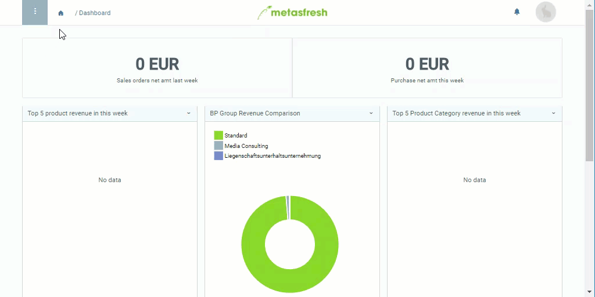

## Überblick
Mithilfe eines Kompensationsgruppenschemas kannst Du kontrollieren, welche Produkte in einem [Auftrag](Auftrag_erfassen) [automatisch zu Kompensationsgruppen zusammengefasst](Kompensationsgruppen_automatisch_erstellen) werden.

## Schritte
1. [Gehe ins Menü](Menu) und öffne das Fenster "Kompensationsgruppe Schema".
1. [Lege ein neues Kompensationsgruppenschema an](Neuer_Datensatz_Fenster_Webui).
1. Benenne das Schema im Feld **Name**, z.B. "Kompensationsgruppe I".
1. Gehe zur Registerkarte "Produkte" unten auf der Seite und klicke auf . Es öffnet sich ein Overlay-Fenster.
1. Wähle ein **Produkt** aus, z.B. *Gruppenrabatt* oder *Gruppierungsprodukt*.
 >**Hinweis:** Du kannst auch jedes andere Produkt auswählen, das im Produktfeld vorgeschlagen wird, sofern es ***nicht lagerhaltig*** und mit ***derselben Preisliste*** verknüpft ist wie der Auftrag.   [Folge dieser Anleitung](Gruppierungsprodukt_anlegen) zur Konfiguration solcher *Gruppierungsprodukte*.

1. ***Optional:*** Gib bereits hier einen **Gesamtauftragsrabatt %** ein, der dann bei der Kompensationsgruppenerstellung automatisch angerechnet wird. Du kannst ihn jedoch auch bei 0 belassen und erst später im Auftrag manuell vergeben.
1. Klicke auf "Bestätigen", um das Overlay-Fenster zu schließen und das Gruppierungsprodukt zur Liste hinzuzufügen.
1. [metasfresh speichert automatisch](Speicheranzeige).

## Nächste Schritte
- [Verknüpfe das Kompensationsgruppenschema mit einer Produktkategorie](Kompensationsgruppenschema_Produktkategorie).

## Beispiel

