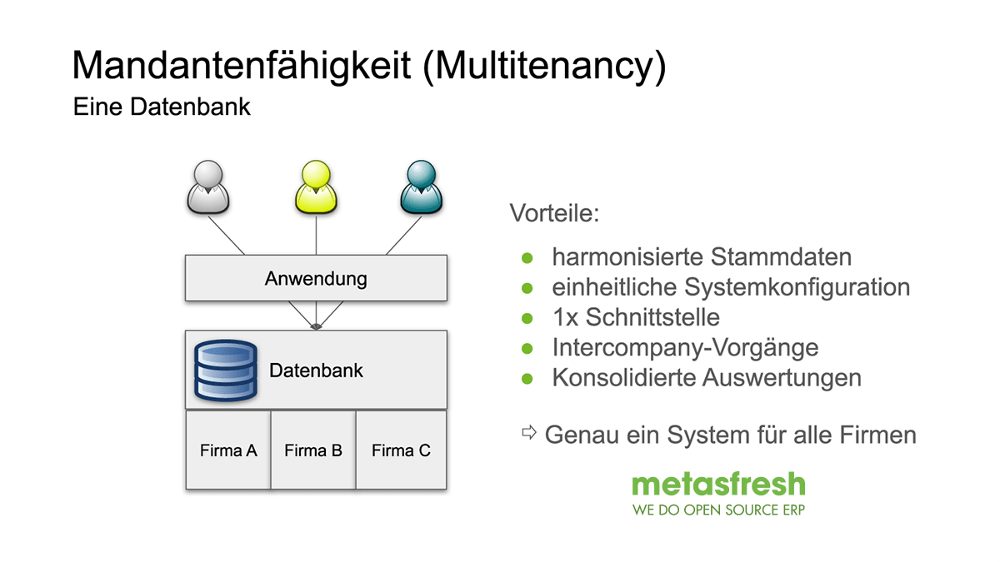

## Überblick
metasfresh unterstützt eine unbegrenzte Anzahl von Mandanten. Die Daten dieser Mandanten werden logisch voneinander getrennt gehalten und sind daher immer nur für den jeweiligen Mandanten sichtbar.

| Mandant | Umfang |
| :---: | :--- |
| * | Beinhaltet alle Systemobjekte wie Fenster, Register, Felder, Berichte, Prozesse, Einstellungen. |
| metasfresh AG | Ist für die Benutzung vorkonfiguriert und enthält einige Beispieldaten. |
| Weitere Mandanten | Grundsätzlich kannst Du so viele Mandanten hinzufügen, wie Du möchtest. **Hinweis:** Das Hinzufügen neuer Mandanten erfordert etwas Konfigurationsaufwand. Wir empfehlen daher den Standardmandanten "metasfresh AG" weiterzuverwenden. |

 

<kbd></kbd>
