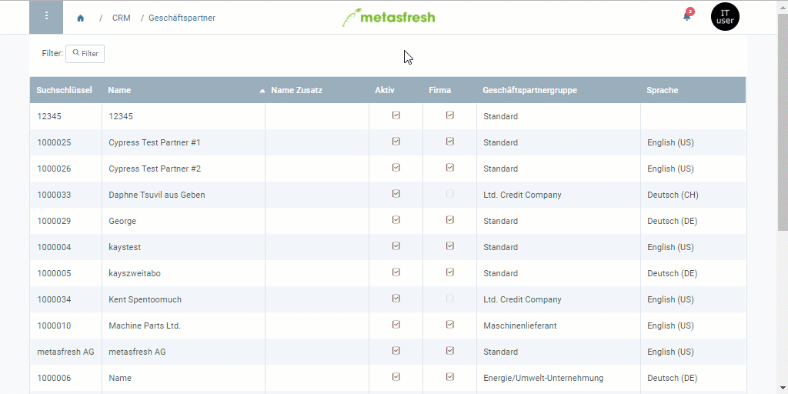

## Überblick
Nur autorisierte Nutzer können Kreditlimits freigeben. Sie erhalten eine Benachrichtigung, sobald eine Freigabe angefordert wird.

## Voraussetzungen
- [Die Freigabe eines Kreditlimits muss angefordert werden](Kreditlimit_Freigabe_anfordern).

## Schritte
1. Öffne den Eintrag des [Geschäftspartners](Menu), für den ein Kreditlimit zur Freigabe angefordert wurde bzw. klicke auf die [Benachrichtigung](Benachrichtigungsarten) , um den Eintrag zu öffnen.
1. Gehe zur Registerkarte "Kreditlimit" unten auf der Seite und [selektiere](AuswahlBelege) die Zeile des Kreditlimits, welches freigegeben werden soll.
 >**Hinweis:** In dem Kontrollkästchen der Spalte **Freigegeben** dieser Zeile ist kein Häkchen gesetzt.

1. [Starte die Aktion](AktionStarten#aktionsmenue) "Kreditlimit freigeben".
1. [metasfresh speichert automatisch](Speicheranzeige).
 >**Hinweis:** Die Meldung "Process completed successfully" erscheint oben rechts im Fenster, in dem Kontrollkästchen der Spalte **Freigegeben** wird ein Häkchen gesetzt und das Feld **Freigegeben von** wird mit dem Namen des autorisierten Nutzers ausgefüllt.

 

| **Allgemeiner Hinweis:** |
| :--- |
| Du kannst auch [Kreditlimitarten anlegen](Kreditlimitart_anlegen), bei denen das Kreditlimit automatisch freigegeben wird, also keine Bestätigung eines autorisierten Nutzers benötigt. In diesem Fall bleibt das Feld **Freigegeben von** der Kreditlimitzeile leer. |

## Beispiel

